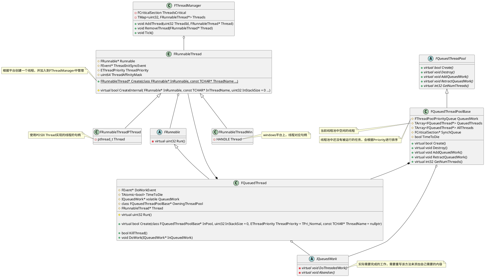
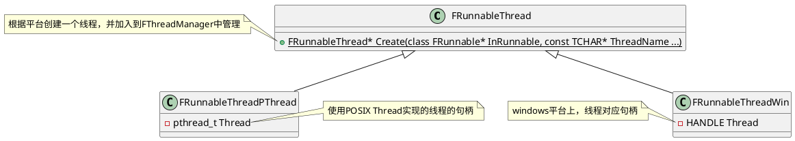
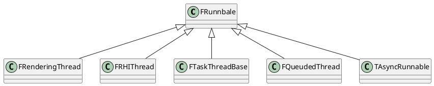
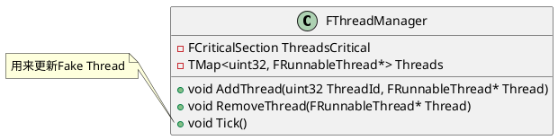
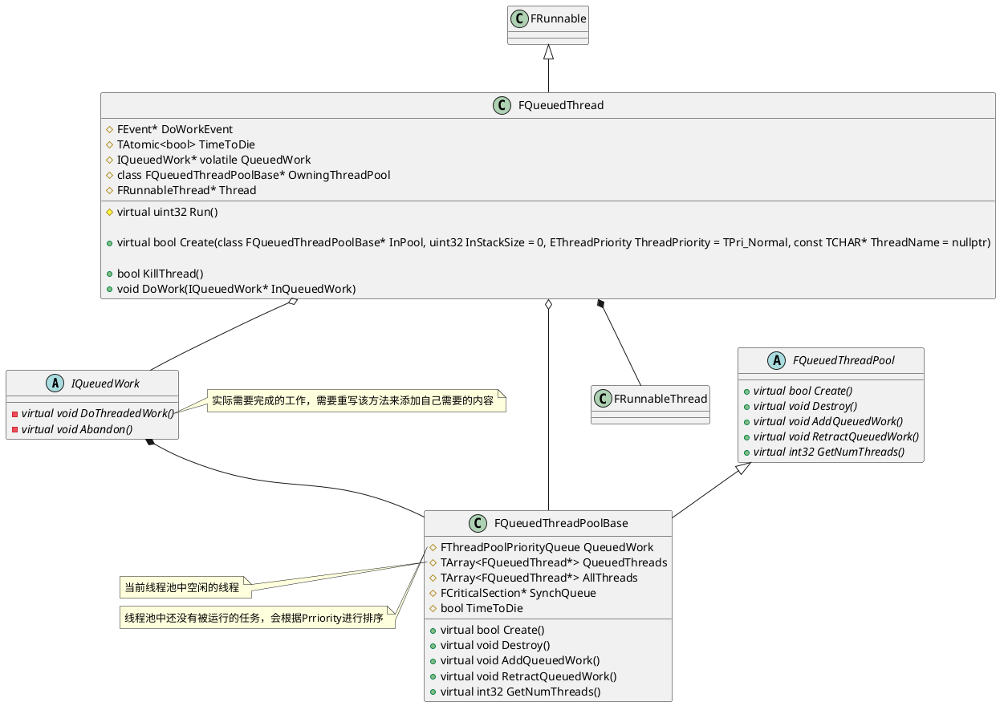
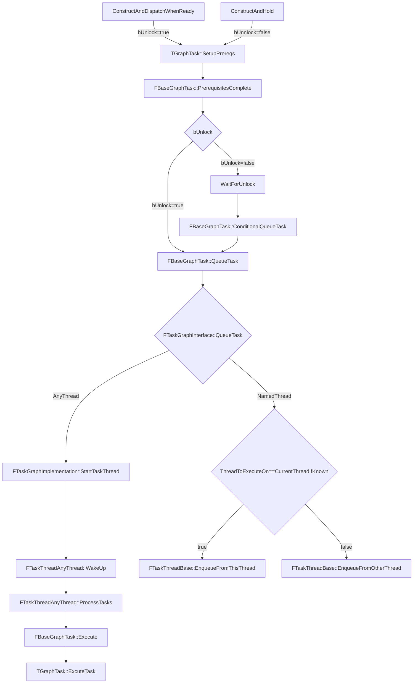
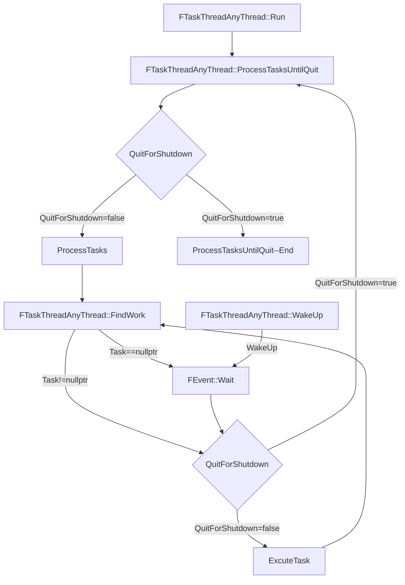

## Unreal Engine中的异步系统

<!-- @import "[TOC]" {cmd="toc" depthFrom=1 depthTo=6 orderedList=false} -->

<!-- code_chunk_output -->

- [Unreal Engine中的异步系统](#unreal-engine中的异步系统)
  - [Overall](#overall)
    - [类图](#类图)
  - [FRunnableThread 和 FRunnable实现](#frunnablethread-和-frunnable实现)
    - [UE中使用异步任务的常用方式](#ue中使用异步任务的常用方式)
    - [FRunnableThread](#frunnablethread)
    - [FRunnable相关实现](#frunnable相关实现)
    - [FThreadManager](#fthreadmanager)
  - [异步任务的实现](#异步任务的实现)
    - [队列化任务的实现](#队列化任务的实现)
      - [FQueuedThread](#fqueuedthread)
      - [FQueuedThreadPoolBase](#fqueuedthreadpoolbase)
    - [TaskGraph的实现](#taskgraph的实现)
    - [FTaskGraphInterface](#ftaskgraphinterface)
    - [TaskGraph运行流程](#taskgraph运行流程)
      - [FTaskGraphImplementation](#ftaskgraphimplementation)
    - [FTaskThreadBase](#ftaskthreadbase)
      - [FTaskThreadAnyThread](#ftaskthreadanythread)
      - [FNamedTaskThread](#fnamedtaskthread)
    - [FBaseGraphTask](#fbasegraphtask)
      - [TGraphTask模板参数TTask](#tgraphtask模板参数ttask)
      - [FConstructor](#fconstructor)
      - [ExecuteTask](#executetask)
    - [FGraphEvent](#fgraphevent)

<!-- /code_chunk_output -->


### Overall
#### 类图


### FRunnableThread 和 FRunnable实现


#### UE中使用异步任务的常用方式
- Async函数
	```cpp
	template<typename CallableType>
	auto Async(EAsyncExecution Execution, CallableType&& Callable, 	TUniqueFunction<void()> CompletionCallback = nullptr) -> 	TFuture<decltype(Forward<CallableType>(Callable)())>
	```
	其中第一个参数**EAsyncExecution Execution**指定了Async的运行方式，	它可以为下面几种情况：
	- **TaskGraph** 通过TaskGraph来执行Task，可以使用**AsyncTask**函数
	- **TaskGraphMainThread** 通过TaskGraph来执行，但是会在主线程上执	行
	- **Thread** 通过自己创建的独立线程来执行Task，也可以使用	**AsyncThread**函数
	- **ThreadPool** 通过线程池来执行Task，也可以使用**AsyncPool**函数
	- **LargeThreadPool** 通过编辑器专用的线程池来执行Task

- 通过实例化**FAsyncTask**或者**FAutoDeleteAsyncTask**模板来实现使用线程池
	FAsyncTask和FAutoDeleteAsyncTask的区别是，FAutoDeleteAsyncTask会在任务完成之后自动delete对应的Task。而FAsyncTask需要我们手动去管理Task的生命周期。
	```cpp
	void DoWork()
	{
		UE::FInheritedContextScope InheritedContextScope = 	RestoreInheritedContext();
		FScopeCycleCounter Scope(Task.GetStatId(), true);
	
		Task.DoWork();
		delete this;
	}
	```
	下面是两个官方给出的使用这两个模板类的示例：
	```cpp
	class ExampleAutoDeleteAsyncTask : public FNonAbandonableTask
	{
		friend class 	FAutoDeleteAsyncTask<ExampleAutoDeleteAsyncTask>;
	
		int32 ExampleData;
	
		ExampleAutoDeleteAsyncTask(int32 InExampleData)
		 : ExampleData(InExampleData)
		{
		}
	
		void DoWork()
		{
			... do the work here
		}
	
		FORCEINLINE TStatId GetStatId() const
		{
			RETURN_QUICK_DECLARE_CYCLE_STAT	(ExampleAutoDeleteAsyncTask, 	STATGROUP_ThreadPoolAsyncTasks);
		}
	};
	
	
	void Example()
	{
		// start an example job
		(new FAutoDeleteAsyncTask<ExampleAutoDeleteAsyncTask>(5)	->StartBackgroundTask();
	
		// do an example job now, on this thread
		(new FAutoDeleteAsyncTask<ExampleAutoDeleteAsyncTask>(5)	->StartSynchronousTask();
	}
	```

#### FRunnableThread
FRunnableThread 是UE中所有线程的基类，根据不同的平台有不同的实现。例如在Windows平台的FRunnableThreadWin，以及通过pthread实现的FRunnableThreadPThread等等。
线程在创建成功之后，会先加入到FThreadManager之中，然后再调用FRunnableThread::Run函数，而后会调用FRunnable::Run
```cpp
// Windows 平台相关的实现
static ::DWORD STDCALL _ThreadProc(LPVOID pThis)
{
	check(pThis);
	auto* ThisThread = (FRunnableThreadWin*)pThis;
	FThreadManager::Get().AddThread(ThisThread->GetThreadID(), ThisThread);
	return ThisThread->GuardedRun();
}

uint32 FRunnableThreadWin::GuardedRun()
{
	uint32 ExitCode = 0;

	FPlatformProcess::SetThreadAffinityMask(ThreadAffinityMask);

	FPlatformProcess::SetThreadName(*ThreadName);
	const TCHAR* CmdLine = ::GetCommandLineW();
	bool bNoExceptionHandler = FParse::Param(::GetCommandLineW(), TEXT("noexceptionhandler"));
#if UE_BUILD_DEBUG
	if (true && !GAlwaysReportCrash)
#else
	if (bNoExceptionHandler || (FPlatformMisc::IsDebuggerPresent() && !GAlwaysReportCrash))
#endif // UE_BUILD_DEBUG
	{
		ExitCode = Run();
	}
	else
	{
#if !PLATFORM_SEH_EXCEPTIONS_DISABLED
		__try
#endif // !PLATFORM_SEH_EXCEPTIONS_DISABLED
		{
			ExitCode = Run();
		}
#if !PLATFORM_SEH_EXCEPTIONS_DISABLED
		__except (FPlatformMisc::GetCrashHandlingType() == ECrashHandlingType::Default ? ReportCrash(GetExceptionInformation()) : EXCEPTION_CONTINUE_SEARCH)
		{
			__try
			{
				// Make sure the information which thread crashed makes it into the log.
				UE_LOG( LogThreadingWindows, Error, TEXT( "Runnable thread %s crashed." ), *ThreadName );
				GWarn->Flush();

				// Append the thread name at the end of the error report.
				FCString::Strncat( GErrorHist, TEXT(LINE_TERMINATOR_ANSI "Crash in runnable thread " ), UE_ARRAY_COUNT( GErrorHist ) );
				FCString::Strncat( GErrorHist, *ThreadName, UE_ARRAY_COUNT( GErrorHist ) );

				// Crashed.
				ExitCode = 1;
				GError->HandleError();
				FPlatformMisc::RequestExit(true, TEXT("FRunnableThreadWin::GuardedRun.ExceptionHandler"));
			}
			__except(EXCEPTION_EXECUTE_HANDLER)
			{
				// The crash handler crashed itself, exit with a code which the 
				// out-of-process monitor will be able to pick up and report into 
				// analytics.

				::exit(ECrashExitCodes::CrashHandlerCrashed);
			}
		}
#endif // !PLATFORM_SEH_EXCEPTIONS_DISABLED
	}

	return ExitCode;
}

uint32 FRunnableThreadWin::Run()
{
	uint32 ExitCode = 1;
	check(Runnable);

	if (Runnable->Init() == true)
	{
		ThreadInitSyncEvent->Trigger();

		// Setup TLS for this thread, used by FTlsAutoCleanup objects.
		SetTls();

		ExitCode = Runnable->Run();

		// Allow any allocated resources to be cleaned up
		Runnable->Exit();

#if STATS
		FThreadStats::Shutdown();
#endif
		FreeTls();
	}
	else
	{
		// Initialization has failed, release the sync event
		ThreadInitSyncEvent->Trigger();
	}

	return ExitCode;
}
```

**FRunnableThread::Create**中会调用FRunnableThread::CreateInternal函数，这个函数在不同的平台有不同的实现，从而创建平台相关的HAL
```cpp
FRunnableThread* FRunnableThread::Create(
	class FRunnable* InRunnable, 
	const TCHAR* ThreadName,
	uint32 InStackSize,
	EThreadPriority InThreadPri, 
	uint64 InThreadAffinityMask,
	EThreadCreateFlags InCreateFlags)
{
	bool bCreateRealThread = FPlatformProcess::SupportsMultithreading();

	FRunnableThread* NewThread = nullptr;

	if (bCreateRealThread)
	{
		check(InRunnable);
		// Create a new thread object
		NewThread = FPlatformProcess::CreateRunnableThread();
	}
	else if (InRunnable->GetSingleThreadInterface())
	{
		// Create a fake thread when multithreading is disabled.
		NewThread = new FFakeThread();
	}

	if (NewThread)
	{
		SetupCreatedThread(NewThread, InRunnable, ThreadName, InStackSize, InThreadPri, InThreadAffinityMask, InCreateFlags);
	}

	return NewThread;
}

void FRunnableThread::SetupCreatedThread(FRunnableThread*& NewThread, class FRunnable* InRunnable,  const TCHAR* ThreadName, uint32 InStackSize, EThreadPriority InThreadPri, uint64 InThreadAffinityMask, EThreadCreateFlags InCreateFlags)
{
	// Call the thread's create method
	bool bIsValid = NewThread->CreateInternal(InRunnable, ThreadName, InStackSize, InThreadPri, InThreadAffinityMask, InCreateFlags);

	if( bIsValid )
	{
		check(NewThread->Runnable);
		NewThread->PostCreate(InThreadPri);
	}
	else
	{
		// We failed to start the thread correctly so clean up
		delete NewThread;
		NewThread = nullptr;
	}
}
```

#### FRunnable相关实现
FRunnable是一个可以运行在线程上的任务的接口，可以通过继承他来实现一个可以在线程上运行的任务，他不能独立的存在，需要依赖真正的线程来执行任务。FRunableThread在运行时，最终会调用到FRunnable::Run。FRunnable的子类有很多，下面列举了一些：


#### FThreadManager
FThreadManager是UE中用于管理线程的类，游戏中创建出来的线程都会加入该管理器中进行管理。该类的功能比较简单，使用一个TMap保存了创建出来的线程，使用ThreadID当Key。另外还会Tick线程中的FFakeThread，FFakeThread是一种假的线程，实际上还是单线程，并没有在一个独立的线程中执行。



### 异步任务的实现

#### 队列化任务的实现
UE中的队列化任务主要有以下几个接口和类来实现：
- IQueuedWork是可以被运行在队列化的线程池中的线程执行的任务的基类。和FRunnable一样，它不能独立的执行自己的任务，需要和相应的线程来配合。
- FQueuedThread，包含了需要执行的任务IQueuedWork和执行任务的线程FRunnableThread，它继承于FRunnable，是真正执行IQueuedWork任务的类。
- FQueuedThreadPool是队列化线程池的基类，定义了线程池所需要的接口。FQueuedThreadPoolBase是UE实现的默认的线程池的版本。



##### FQueuedThread
FQueuedThread继承于FRunable，同时它也包含一个FRunnableThread的引用。一方面它代表了被线程池管理的那些线程，另外一方面它也包含了执行任务的逻辑。它的任务就是在运行的时候不断的从线程池中拿出队列中还没有执行的任务，然后执行它。如果线程池中的任务已经被执行完了，它就会把自己返回到线程池的空闲队列中。主要的逻辑在FQueuedThread::Run中：
```cpp
uint32 FQueuedThread::Run()
{
	while (!TimeToDie.Load(EMemoryOrder::Relaxed))
	{
		// This will force sending the stats packet from the previous frame.
		SET_DWORD_STAT(STAT_ThreadPoolDummyCounter, 0);
		// We need to wait for shorter amount of time
		bool bContinueWaiting = true;

		// Unless we're collecting stats there doesn't appear to be any reason to wake
		// up again until there's work to do (or it's time to die)

#if STATS
		if (FThreadStats::IsCollectingData())
		{
			while (bContinueWaiting)
			{
				DECLARE_CYCLE_STAT_WITH_FLAGS(TEXT("FQueuedThread::Run.WaitForWork"),
				STAT_FQueuedThread_Run_WaitForWork, STATGROUP_ThreadPoolAsyncTasks,
					EStatFlags::Verbose);

				SCOPE_CYCLE_COUNTER(STAT_FQueuedThread_Run_WaitForWork);

				// Wait for some work to do

				bContinueWaiting = !DoWorkEvent->Wait(GDoPooledThreadWaitTimeouts ? 10 : MAX_uint32);
			}
		}
#endif

		if (bContinueWaiting)
		{
			DoWorkEvent->Wait();
		}

		IQueuedWork* LocalQueuedWork = QueuedWork;
		QueuedWork = nullptr;
		FPlatformMisc::MemoryBarrier();
		check(LocalQueuedWork || TimeToDie.Load(EMemoryOrder::Relaxed)); // well you woke me up, where is the job or termination request?
		while (LocalQueuedWork)
		{
			// Tell the object to do the work
			LocalQueuedWork->DoThreadedWork();
			// Let the object cleanup before we remove our ref to it
			LocalQueuedWork = OwningThreadPool->ReturnToPoolOrGetNextJob(this);
		}
	}
	return 0;
}
```

##### FQueuedThreadPoolBase
FQueuedThreadPoolBase是UE中线程池的实现，主要就是管理线程池中的任务，先线程池中添加新任务，撤回任务这些等等。
- QueuedThreadPoolBase::AddQueuedWork 向线程池中添加任务，如果线程池中有空闲的线程，则开始执行该任务
- QueuedThreadPoolBase::RetractQueuedWork 如果该任务还没有开始执行，则撤销该任务，之后不会执行该任务
- QueuedThreadPoolBase::ReturnToPoolOrGetNextJob 这个接口会被FQueuedThread调用，当FQueuedThread执行完一个任务后，会调用该接口。如果已经没有可执行的任务了，会将FQueuedThread归还到空闲的线程池列表中。如果还有未执行的任务，则会从未执行的任务列表拿出来，然后执行。FQueuedThreadPoolBase和FQueuedThread是一个生产者和消费着模型。
```cpp
void AddQueuedWork(IQueuedWork* InQueuedWork, EQueuedWorkPriority InQueuedWorkPriority) override
{
	check(InQueuedWork != nullptr);

	if (TimeToDie)
	{
		InQueuedWork->Abandon();
		return;
	}

	// Check to see if a thread is available. Make sure no other threads
	// can manipulate the thread pool while we do this.
	//
	// We pick a thread from the back of the array since this will be the
	// most recently used thread and therefore the most likely to have
	// a 'hot' cache for the stack etc (similar to Windows IOCP scheduling
	// strategy). Picking from the back also happens to be cheaper since
	// no memory movement is necessary.

	check(SynchQueue);

	FQueuedThread* Thread = nullptr;

	{
		FScopeLock sl(SynchQueue);
		const int32 AvailableThreadCount = QueuedThreads.Num();
		if (AvailableThreadCount == 0)
		{
			// No thread available, queue the work to be done
			// as soon as one does become available
			QueuedWork.Enqueue(InQueuedWork, InQueuedWorkPriority);
			return;
		}

		const int32 ThreadIndex = AvailableThreadCount - 1;

		Thread = QueuedThreads[ThreadIndex];
		// Remove it from the list so no one else grabs it
		QueuedThreads.RemoveAt(ThreadIndex, 1, /* do not allow shrinking */ false);
	}

	// Tell our chosen thread to do the work
	Thread->DoWork(InQueuedWork);
}

virtual bool RetractQueuedWork(IQueuedWork* InQueuedWork) override
{
	if (TimeToDie)
	{
		return false; // no special consideration for this, refuse the retraction and let shutdown proceed
	}
	check(InQueuedWork != nullptr);
	check(SynchQueue);
	FScopeLock sl(SynchQueue);
	return QueuedWork.Retract(InQueuedWork);
}

IQueuedWork* ReturnToPoolOrGetNextJob(FQueuedThread* InQueuedThread)
{
	check(InQueuedThread != nullptr);
	IQueuedWork* Work = nullptr;
	// Check to see if there is any work to be done
	FScopeLock sl(SynchQueue);
	if (TimeToDie)
	{
		check(!QueuedWork.Num());  // we better not have anything if we are dying
	}
	
	Work = QueuedWork.Dequeue();

	if (!Work)
	{
		// There was no work to be done, so add the thread to the pool
		QueuedThreads.Add(InQueuedThread);
	}
	return Work;
}
```

#### TaskGraph的实现

```plantuml
@startuml
abstract class FBaseGraphTask
{
	- virtual void ExecuteTask(TArray<FBaseGraphTask*>& NewTasks, ENamedThreads::Type CurrentThread, bool bDeleteOnCompletion)
	- virtual void DeleteTask()

}

class FConstructor<T>
{
	+ FGraphEventRef ConstructAndDispatchWhenReady(T&&... Args)
	+ TGraphTask* ConstructAndHold(T&&... Args)
}

class FGraphEvent
{
	{static} + FGraphEventRef CreateGraphEvent()
	+ bool AddSubsequent(class FBaseGraphTask* Subsequent)
	+ void DispatchSubsequents(ENamedThreads::Type CurrentThreadIfKnown = ENamedThreads::AnyThread)
	+ void DispatchSubsequents(TArray<FBaseGraphTask*>& NewTasks, ENamedThreads::Type CurrentThreadIfKnown = ENamedThreads::AnyThread, bool bInternal = false)

	- TClosableLockFreePointerListUnorderedSingleConsumer<FBaseGraphTask, 0>	SubsequentList
	- FGraphEventArray EventsToWaitFor
	- FThreadSafeCounter ReferenceCount
}

class TGraphTask<TTask>
{
	{static} + FConstructor CreateTask(const FGraphEventArray* Prerequisites = NULL, ENamedThreads::Type CurrentThreadIfKnown = ENamedThreads::AnyThread)
	
	- void ExecuteTask(TArray<FBaseGraphTask*>& NewTasks, ENamedThreads::Type CurrentThread, bool bDeleteOnCompletion)
	- void DeleteTask()
	- void SetupPrereqs(const FGraphEventArray* Prerequisites, ENamedThreads::Type CurrentThreadIfKnown, bool bUnlock)
	- FGraphEventRef Setup(const FGraphEventArray* Prerequisites = NULL, ENamedThreads::Type CurrentThreadIfKnown = ENamedThreads::AnyThread)
	- TGraphTask* Hold(const FGraphEventArray* Prerequisites = NULL, ENamedThreads::Type CurrentThreadIfKnown = ENamedThreads::AnyThread)

	- TAlignedBytes<sizeof(TTask),alignof(TTask)> TaskStorage
	- bool TaskConstructed
	- FGraphEventRef Subsequents
}

FBaseGraphTask <|-- TGraphTask
FConstructor <.. TGraphTask
FGraphEvent *-- TGraphTask

abstract class FTaskThreadBase
{
	{abstract} + virtual void ProcessTaskUntilQuit(int32 QueueIndex)
	+ virtual uint64 ProcessTasksUntilIdle(int32 QueueIndex)
	+ virtual void EnqueueFromThisThread(int32 QueueIndex, FBaseGraphTask* Task)
	+ virtual void RequestQuit(int32 QueueIndex)
	+ virtual bool EnqueueFromOtherThread(int32 QueueIndex, FBaseGraphTask* Task)
	+ virtual void WakeUp(int32 QueueIndex = 0)
	+ virtual bool IsProcessingTasks(int32 QueueIndex)
	+ virtual uint32 Run()

	# ENamedThreads::Type ThreadId
	# uint32 PerThreadIDTLSSlot
	# FThreadSafeCounter IsStalled
	# TArray<FBaseGraphTask*> NewTasks
	# FWorkerThread* OwnerWorker
}

FBaseGraphTask *-- FTaskThreadBase

FRunnable <|-- FTaskThreadBase

struct FWorkerThread
{
	FTaskThreadBase* TaskGraphWorker
	FRunnableThread* RunnableThread
	bool bAttached
}

FWorkerThread *--* FTaskThreadBase
FRunnableThread *-- FWorkerThread

class FNamedTaskThread
{

}

FTaskThreadBase <|-- FNamedTaskThread

class FTaskThreadAnyThread
{

}
FTaskThreadBase <|-- FTaskThreadAnyThread


abstract class FTaskGraphInterface
{
	{abstract} + virtual void QueueTask(class FBaseGraphTask* Task, bool bWakeUpWorker, ENamedThreads::Type ThreadToExecuteOn, ENamedThreads::Type CurrentThreadIfKnown = ENamedThreads::AnyThread)

	{abstract} + virtual uint64 ProcessThreadUntilIdle(ENamedThreads::Type CurrentThread)
	{abstract} + virtual void ProcessThreadUntilRequestReturn(ENamedThreads::Type CurrentThread)
	{abstract} + virtual void WaitUntilTasksComplete(const FGraphEventArray& Tasks, ENamedThreads::Type CurrentThreadIfKnown = ENamedThreads::AnyThread)
}

class FTaskGraphImplementation
{
	- FWorkerThread WorkerThreads[MAX_THREADS]
	
	- int32 NumThreads
	- int32 NumNamedThreads
	- int32 NumTaskThreadSets
	- int32 NumTaskThreadsPerSet
	- bool bCreatedHiPriorityThreads
	- bool bCreatedBackgroundPriorityThreads

	- ENamedThreads::Type LastExternalThread
	- FThreadSafeCounter	ReentrancyCheck

	- uint32 PerThreadIDTLSSlot

	{field} - TArray<TFunction<void()> > ShutdownCallbacks

	- FStallingTaskQueue<FBaseGraphTask, PLATFORM_CACHE_LINE_SIZE, 2>	IncomingAnyThreadTasks[MAX_THREAD_PRIORITIES]
}

FTaskGraphInterface <|-- FTaskGraphImplementation
FBaseGraphTask *-- FTaskGraphImplementation
FWorkerThread *-- FTaskGraphImplementation

class FTaskGraphCompatibilityImplementation
{
	
}

FTaskGraphInterface <|-- FTaskGraphCompatibilityImplementation


@enduml
```

#### FTaskGraphInterface
在TaskGraph中，FTaskGraphInterface是TaskGraph的接口类，用管理TaskGraph相关的工作，具体的实现在FTaskGraphImplementation和FTaskGraphCompatibilityImplementation来完成，是一个单例类。UE4中FTaskGraphInterface只有FTaskGraphImplementation一个实现，FTaskGraphCompatibilityImplementation是UE5中新的实现，也是UE5中默认实现。也可以通过**GUseNewTaskBackend**切换到旧的实现方式。

在TaskGraph中，有两种类型的线程，一个是NamedThread，一个是AnyThread。分别对应FNamedTaskThread和FTaskThreadAnyThread。AnyTread会在TaskGraph初始化的时候被创建出来。NamedThread会在该类型的线程创建的时候Attach到相应的Workder中。目前支持的NamedThread有：
- RHIThread RHI线程
- GameThread 游戏线程
- RenderThread 渲染线程

```cpp
enum Type : int32
{
	UnusedAnchor = -1,
	/** The always-present, named threads are listed next **/
	RHIThread,
	GameThread,
	// The render thread is sometimes the game thread and is sometimes the actual rendering thread
	ActualRenderingThread = GameThread + 1,
	// CAUTION ThreadedRenderingThread must be the last named thread, insert new named threads before it

	/** not actually a thread index. Means "Unknown Thread" or "Any Unnamed Thread" **/
	AnyThread = 0xff, 
	....
}
```

对于TaskGraph中的任务和线程也分别有不同的优先级。有普通和高优先级的任务，也有各种不同优先级的线程。
- NormalTaskPriority  普通优先级任务
- HighTaskPriority  高优先级任务
- NormalThreadPriority  普通优先级线程
- HighThreadPriority  高优先级线程
- BackgroundThreadPriority  低优先级线程

然后还可以通过这些不同的flag进行组合，组合成不同类型。同时由于这些Flag占用了不同位，所以也可以通过位运算，将其中的不同的属性单独拿出来。UE中也定义了相应的函数。最后这些所有属性的组合决定了我们当前的任务在哪一个线程中来运行。例如AnyHiPriThreadNormalTask就是运行在一个高优先级AnyThread的普通优先级的任务。

|10和11位用来表示线程的优先级|9位用来表示任务的优先级|8位用来表示NamedThread 任务队列|0~7位用来表示当前的线程类型|
|:--:|:--:|:--:|:--:|

```cpp
enum Type : int32
{
	 ...

	MainQueue =			0x000,
	LocalQueue =		0x100,

	NumQueues =			2,
	ThreadIndexMask =	0xff,
	QueueIndexMask =	0x100,
	QueueIndexShift =	8,

	/** High bits are used for a queue index task priority and thread priority**/

	NormalTaskPriority =	0x000,
	HighTaskPriority =		0x200,

	NumTaskPriorities =		2,
	TaskPriorityMask =		0x200,
	TaskPriorityShift =		9,

	NormalThreadPriority = 0x000,
	HighThreadPriority = 0x400,
	BackgroundThreadPriority = 0x800,

	NumThreadPriorities = 3,
	ThreadPriorityMask = 0xC00,
	ThreadPriorityShift = 10,

	/** Combinations **/
	GameThread_Local = GameThread | LocalQueue,
	ActualRenderingThread_Local = ActualRenderingThread | LocalQueue,

	AnyHiPriThreadNormalTask = AnyThread | HighThreadPriority | NormalTaskPriority,
	AnyHiPriThreadHiPriTask = AnyThread | HighThreadPriority | HighTaskPriority,

	AnyNormalThreadNormalTask = AnyThread | NormalThreadPriority | NormalTaskPriority,
	AnyNormalThreadHiPriTask = AnyThread | NormalThreadPriority | HighTaskPriority,

	AnyBackgroundThreadNormalTask = AnyThread | BackgroundThreadPriority | NormalTaskPriority,
	AnyBackgroundHiPriTask = AnyThread | BackgroundThreadPriority | HighTaskPriority,
};

//辅助函数，用于设置和获取不同的Flag
FORCEINLINE Type GetThreadIndex(Type ThreadAndIndex)
{
	return ((ThreadAndIndex & ThreadIndexMask) == AnyThread) ? AnyThread : Type(ThreadAndIndex & ThreadIndexMask);
}

FORCEINLINE int32 GetQueueIndex(Type ThreadAndIndex)
{
	return (ThreadAndIndex & QueueIndexMask) >> QueueIndexShift;
}

FORCEINLINE int32 GetTaskPriority(Type ThreadAndIndex)
{
	return (ThreadAndIndex & TaskPriorityMask) >> TaskPriorityShift;
}

FORCEINLINE int32 GetThreadPriorityIndex(Type ThreadAndIndex)
{
	int32 Result = (ThreadAndIndex & ThreadPriorityMask) >> ThreadPriorityShift;
	check(Result >= 0 && Result < NumThreadPriorities);
	return Result;
}

FORCEINLINE Type SetPriorities(Type ThreadAndIndex, Type ThreadPriority, Type TaskPriority)
{
	check(
		!(ThreadAndIndex & ~ThreadIndexMask) &&  // not a thread index
		!(ThreadPriority & ~ThreadPriorityMask) && // not a thread priority
		(ThreadPriority & ThreadPriorityMask) != ThreadPriorityMask && // not a valid thread priority
		!(TaskPriority & ~TaskPriorityMask) // not a task priority
		);
	return Type(ThreadAndIndex | ThreadPriority | TaskPriority);
}

FORCEINLINE Type SetPriorities(Type ThreadAndIndex, int32 PriorityIndex, bool bHiPri)
{
	check(
		!(ThreadAndIndex & ~ThreadIndexMask) && // not a thread index
		PriorityIndex >= 0 && PriorityIndex < NumThreadPriorities // not a valid thread priority
		);
	return Type(ThreadAndIndex | (PriorityIndex << ThreadPriorityShift) | (bHiPri ? HighTaskPriority : NormalTaskPriority));
}

FORCEINLINE Type SetThreadPriority(Type ThreadAndIndex, Type ThreadPriority)
{
	check(
		!(ThreadAndIndex & ~ThreadIndexMask) &&  // not a thread index
		!(ThreadPriority & ~ThreadPriorityMask) && // not a thread priority
		(ThreadPriority & ThreadPriorityMask) != ThreadPriorityMask // not a valid thread priority
		);
	return Type(ThreadAndIndex | ThreadPriority);
}

FORCEINLINE Type SetTaskPriority(Type ThreadAndIndex, Type TaskPriority)
{
	check(
		!(ThreadAndIndex & ~ThreadIndexMask) &&  // not a thread index
		!(TaskPriority & ~TaskPriorityMask) // not a task priority
		);
	return Type(ThreadAndIndex | TaskPriority);
}
```

对于AnyThread而言，会在初始化的时候，根据当前系统和CPU的核心数量，还有相应的config来决定创建多少AnyThread。对于AnyThread而言，又有线程集（Thread Set）和线程优先级（Thread Priority）的概念。
- 线程优先级
TaskGraph中有三个优先级的线程，分别是Normal, High, Background。High的优先级最高，Background的优先级最低。

- 线程集
一组由多个同一优先级的线程组成的集合叫线程集，UE中至少有一个线程集，最多有三个线程集。线程集的数量和当前引擎的设置有关。下面的代码是线程集数量的计算方式：
```cpp
NumTaskThreadSets = 1 + bCreatedHiPriorityThreads + bCreatedBackgroundPriorityThreads
```

NamedTread是通过外部设置到TaskGraph中来的，并未TaskGraph内部创建的。可以通过函数**FTaskGraphInterface::AttachToThread**来设置NamedThread。
```cpp
virtual void AttachToThread(ENamedThreads::Type CurrentThread) final override
{
	CurrentThread = ENamedThreads::GetThreadIndex(CurrentThread);
	check(NumTaskThreadsPerSet);
	check(CurrentThread >= 0 && CurrentThread < NumNamedThreads);
	check(!WorkerThreads[CurrentThread].bAttached);
	Thread(CurrentThread).InitializeForCurrentThread();
}
```

GameThread和RenderThread这些NamedThread都会在线程创建成功后，就把对应的线程Attach到TaskGraph中来。
```cpp
void RenderingThreadMain( FEvent* TaskGraphBoundSyncEvent )
{
	LLM_SCOPE(ELLMTag::RenderingThreadMemory);

	ENamedThreads::Type RenderThread = ENamedThreads::Type(ENamedThreads::ActualRenderingThread);

	ENamedThreads::SetRenderThread(RenderThread);
	ENamedThreads::SetRenderThread_Local(ENamedThreads::Type(ENamedThreads::ActualRenderingThread_Local));

	FTaskGraphInterface::Get().AttachToThread(RenderThread);
	...
}

// FRHIThread::Run
virtual uint32 Run() override
{
	LLM_SCOPE(ELLMTag::RHIMisc);

#if CSV_PROFILER
	FCsvProfiler::Get()->SetRHIThreadId(FPlatformTLS::GetCurrentThreadId());
#endif

	FMemory::SetupTLSCachesOnCurrentThread();
	{
		FTaskTagScope Scope(ETaskTag::ERhiThread);
		FPlatformProcess::SetupRHIThread();
		FTaskGraphInterface::Get().AttachToThread(ENamedThreads::RHIThread);
		FTaskGraphInterface::Get().ProcessThreadUntilRequestReturn(ENamedThreads::RHIThread);
	}
	FMemory::ClearAndDisableTLSCachesOnCurrentThread();
	return 0;
}

int32 FEngineLoop::PreInitPreStartupScreen(const TCHAR* CmdLine)
{
	....

	if (bCreateTaskGraphAndThreadPools)
	{
		// initialize task graph sub-system with potential multiple threads
		SCOPED_BOOT_TIMING("FTaskGraphInterface::Startup");
		FTaskGraphInterface::Startup(FPlatformMisc::NumberOfWorkerThreadsToSpawn());
		FTaskGraphInterface::Get().AttachToThread(ENamedThreads::GameThread);
	}

	...
}

```

#### TaskGraph运行流程


##### FTaskGraphImplementation
FTaskGraphImplementation在初始化时候，会根据当前系统的核心数量和配置初始化一定数量的Worker。对于AnyThread，还会创建其对应的FRunnableThread，计算对应线程的Affinity。

当前系统的核心数会决定线程集的数量，而每个线程集中的线程数量取决于**ENamedThreads::bHasHighPriorityThreads和ENamedThreads::bHasBackgroundThreads**。最终Worker的数量计算公式为：**NumTaskThreads * NumTaskThreadSets + NumNamedThreads**，然后根据实际的情况进行clamp。
```cpp
FTaskGraphImplementation(int32)
{
	TaskTrace::Init();
	bCreatedHiPriorityThreads = !!ENamedThreads::bHasHighPriorityThreads;
	bCreatedBackgroundPriorityThreads = !!ENamedThreads::bHasBackgroundThreads;
	int32 MaxTaskThreads = MAX_THREADS;
	int32 NumTaskThreads = FPlatformMisc::NumberOfWorkerThreadsToSpawn();
	// if we don't want any performance-based threads, then force the task graph to not create any worker threads, and run in game thread
	if (!FTaskGraphInterface::IsMultithread())
	{
		// this is the logic that used to be spread over a couple of places, that will make the rest of this function disable a workerthread
		// @todo: it could probably be made simpler/clearer
		// this - 1 tells the below code there is no rendering thread
		MaxTaskThreads = 1;
		NumTaskThreads = 1;
		LastExternalThread = (ENamedThreads::Type)(ENamedThreads::ActualRenderingThread - 1);
		bCreatedHiPriorityThreads = false;
		bCreatedBackgroundPriorityThreads = false;
		ENamedThreads::bHasBackgroundThreads = 0;
		ENamedThreads::bHasHighPriorityThreads = 0;
	}
	else
	{
		LastExternalThread = ENamedThreads::ActualRenderingThread;
		if (FForkProcessHelper::IsForkedMultithreadInstance())
		{
			NumTaskThreads = CVar_ForkedProcess_MaxWorkerThreads;
		}
	}
	
	NumNamedThreads = LastExternalThread + 1;
	NumTaskThreadSets = 1 + bCreatedHiPriorityThreads + bCreatedBackgroundPriorityThreads;
	// if we don't have enough threads to allow all of the sets asked for, then we can't create what was asked for.
	check(NumTaskThreadSets == 1 || FMath::Min<int32>(NumTaskThreads * NumTaskThreadSets + NumNamedThreads, MAX_THREADS) == NumTaskThreads* NumTaskThreadSets + NumNamedThreads);
	NumThreads = FMath::Max<int32>(FMath::Min<int32>(NumTaskThreads * NumTaskThreadSets + NumNamedThreads, MAX_THREADS), NumNamedThreads +1);
	// Cap number of extra threads to the platform worker thread count
	// if we don't have enough threads to allow all of the sets asked for, then we can't create what was asked for.
	check(NumTaskThreadSets == 1 || FMath::Min(NumThreads, NumNamedThreads + NumTaskThreads * NumTaskThreadSets) == NumThreads);
	NumThreads = FMath::Min(NumThreads, NumNamedThreads + NumTaskThreads * NumTaskThreadSets);
	NumTaskThreadsPerSet = (NumThreads - NumNamedThreads) / NumTaskThreadSets;
	check((NumThreads - NumNamedThreads) % NumTaskThreadSets == 0); // should be equal numbers of threads per priority set
	UE_LOG(LogTaskGraph, Log, TEXT("Started task graph with %d named threads and %d total threads with %d sets of task threads."),NumNamedThreads, NumThreads, NumTaskThreadSets);
	check(NumThreads - NumNamedThreads >= 1);  // need at least one pure worker thread
	check(NumThreads <= MAX_THREADS);
	check(!ReentrancyCheck.GetValue()); // reentrant?
	ReentrancyCheck.Increment(); // just checking for reentrancy
	PerThreadIDTLSSlot = FPlatformTLS::AllocTlsSlot();
	for (int32 ThreadIndex = 0; ThreadIndex < NumThreads; ThreadIndex++)
	{
		check(!WorkerThreads[ThreadIndex].bAttached); // reentrant?
		bool bAnyTaskThread = ThreadIndex >= NumNamedThreads;
		if (bAnyTaskThread)
		{
			WorkerThreads[ThreadIndex].TaskGraphWorker = new FTaskThreadAnyThread(ThreadIndexToPriorityIndex(ThreadIndex));
		}
		else
		{
			WorkerThreads[ThreadIndex].TaskGraphWorker = new FNamedTaskThread;
		}
		WorkerThreads[ThreadIndex].TaskGraphWorker->Setup(ENamedThreads::Type(ThreadIndex), PerThreadIDTLSSlot, &WorkerThread[ThreadIndex]);
	}
	TaskGraphImplementationSingleton = this; // now reentrancy is ok
	const TCHAR* PrevGroupName = nullptr;
	for (int32 ThreadIndex = LastExternalThread + 1; ThreadIndex < NumThreads; ThreadIndex++)
	{
		FString Name;
		const TCHAR* GroupName = TEXT("TaskGraphNormal");
		int32 Priority = ThreadIndexToPriorityIndex(ThreadIndex);
        // These are below normal threads so that they sleep when the named threads are active
		EThreadPriority ThreadPri;
		uint64 Affinity = FPlatformAffinity::GetTaskGraphThreadMask();
		if (Priority == 1)
		{
			Name = FString::Printf(TEXT("TaskGraphThreadHP %d"), ThreadIndex - (LastExternalThread + 1));
			GroupName = TEXT("TaskGraphHigh");
			ThreadPri = TPri_SlightlyBelowNormal; // we want even hi priority tasks below the normal threads
			// If the platform defines FPlatformAffinity::GetTaskGraphHighPriorityTaskMask then use it
			if (FPlatformAffinity::GetTaskGraphHighPriorityTaskMask() != 0xFFFFFFFFFFFFFFFF)
			{
				Affinity = FPlatformAffinity::GetTaskGraphHighPriorityTaskMask();
			}
		}
		else if (Priority == 2)
		{
			Name = FString::Printf(TEXT("TaskGraphThreadBP %d"), ThreadIndex - (LastExternalThread + 1));
			GroupName = TEXT("TaskGraphLow");
			ThreadPri = TPri_Lowest;
			// If the platform defines FPlatformAffinity::GetTaskGraphBackgroundTaskMask then use it
			if ( FPlatformAffinity::GetTaskGraphBackgroundTaskMask() != 0xFFFFFFFFFFFFFFFF )
			{
				Affinity = FPlatformAffinity::GetTaskGraphBackgroundTaskMask();
			}
		}
		else
		{
			Name = FString::Printf(TEXT("TaskGraphThreadNP %d"), ThreadIndex - (LastExternalThread + 1));
			ThreadPri = TPri_BelowNormal; // we want normal tasks below normal threads like the game thread
		}
		int32 StackSize;
		StackSize = 1024 * 1024;
		if (FForkProcessHelper::IsForkedMultithreadInstance() && GAllowTaskGraphForkMultithreading)
		{
			WorkerThreads[ThreadIndex].RunnableThread = FForkProcessHelper::CreateForkableThread(&Thread(ThreadIndex), *Name, StackSize,ThreadPri, Affinity);
		}
		else
		{
			WorkerThreads[ThreadIndex].RunnableThread = FRunnableThread::Create(&Thread(ThreadIndex), *Name, StackSize, ThreadPri,Affinity); 
		}
		
		WorkerThreads[ThreadIndex].bAttached = true;
	}
	UE::Trace::ThreadGroupEnd();
}
```

从代码中可以看出，最终创建的线程都会放在**FTaskGraphImplementation::WorkderThreads**这个数组中，而且会按照顺序排列，所以我们就可以直接通过Index来获取当前Thread的属性，是执行什么任务的线程。


#### FTaskThreadBase
FTaskThreadBase继承于FRunnable，是一个抽象类。FTaskThreadAnyThread和FNamedTaskThread都继承于它，是TaskGraph中的线程真正运行的对象。在TaskGraph运行的时候，FTaskThreadAnyThread和FNamedTaskThread会通过自己的运行逻辑，拿到真正需要的运行的FBaseGraphTask，从而运行真正的任务。

FRunnable对象最后会被对应的线程调用FRunnable::Run中，所以FTaskThreadBase的主要运行逻辑也在FTaskThreadBase::Run中。FTaskThreadBase::Run中调用了FTaskThreadBase::ProcessTasksUntilQuit，而该函数是一个纯虚函数，所以对应的逻辑在子类中实现。

##### FTaskThreadAnyThread
FTaskThreadAnyThread 代表了两种线程中的AnyThread，它的数量会在FTaskGraphImplementation初始化的时候根据当前系统的核心数量以及一些配置来决定。FTaskThreadAnyThread的主要函数为FTaskThreadAnyThread::ProcessTasks，这个函数会从FTaskGraphInterface中去寻找自己ThreadId所对应的任务。
```cpp
	uint64 ProcessTasks()
	{
		LLM_SCOPE_BYNAME(TEXT("Tasks/AnyThread/ProcessTasks"));

		TStatId StallStatId;
		bool bCountAsStall = true;
		uint64 ProcessedTasks = 0;
#if STATS
		TStatId StatName;
		FCycleCounter ProcessingTasks;
		StatName = GET_STATID(STAT_TaskGraph_OtherTasks);
		StallStatId = GET_STATID(STAT_TaskGraph_OtherStalls);
		bool bTasksOpen = false;
		if (FThreadStats::IsCollectingData(StatName))
		{
			bTasksOpen = true;
			ProcessingTasks.Start(StatName);
		}
#endif
		verify(++Queue.RecursionGuard == 1);
		bool bDidStall = false;
		while (1)
		{
			FBaseGraphTask* Task = FindWork();
			if (!Task)
			{
#if STATS
				if (bTasksOpen)
				{
					ProcessingTasks.Stop();
					bTasksOpen = false;
				}
#endif

				TestRandomizedThreads();
				const bool bIsMultithread = FTaskGraphInterface::IsMultithread();
				if (bIsMultithread)
				{
					FScopeCycleCounter Scope(StallStatId, EStatFlags::Verbose);
					Queue.StallRestartEvent->Wait(MAX_uint32, bCountAsStall);
					bDidStall = true;
				}
				if (Queue.QuitForShutdown || !bIsMultithread)
				{
					break;
				}
				TestRandomizedThreads();

#if STATS
				if (FThreadStats::IsCollectingData(StatName))
				{
					bTasksOpen = true;
					ProcessingTasks.Start(StatName);
				}
#endif
				continue;
			}
			TestRandomizedThreads();
#if YIELD_BETWEEN_TASKS
			// the Win scheduler is ill behaved and will sometimes let BG tasks run even when other tasks are ready....kick the scheduler between tasks
			if (!bDidStall && PriorityIndex == (ENamedThreads::BackgroundThreadPriority >> ENamedThreads::ThreadPriorityShift))
			{
				FPlatformProcess::Sleep(0);
			}
#endif
			bDidStall = false;
			Task->Execute(NewTasks, ENamedThreads::Type(ThreadId), true);
			ProcessedTasks++;
			TestRandomizedThreads();
			if (Queue.bStallForTuning)
			{
#if STATS
				if (bTasksOpen)
				{
					ProcessingTasks.Stop();
					bTasksOpen = false;
				}
#endif
				{
					FScopeLock Lock(&Queue.StallForTuning);
				}
#if STATS
				if (FThreadStats::IsCollectingData(StatName))
				{
					bTasksOpen = true;
					ProcessingTasks.Start(StatName);
				}
#endif
			}
		}
		verify(!--Queue.RecursionGuard);
		return ProcessedTasks;
	}

```

可以从上面看出来，首先通过FinWork去获取当前的Thread需要的Task，如果没有获取到Task，就会阻塞休眠当前线程直到被唤醒。如果获取到了Task，则会运行对应的Task。


FindWork会从**IncomingAnyThreadTasks**从去找到对应的Task，IncomingAnyThreadTasks是一个所有AnyThread公用的一个列表。这里面会记录所有需要AnyTread去运行的Task。
```cpp
FBaseGraphTask* FindWork(ENamedThreads::Type ThreadInNeed) override
{
	int32 LocalNumWorkingThread = GetNumWorkerThreads() + GNumWorkerThreadsToIgnore;
	int32 MyIndex = int32((uint32(ThreadInNeed) - NumNamedThreads) % NumTaskThreadsPerSet);
	int32 Priority = int32((uint32(ThreadInNeed) - NumNamedThreads) / NumTaskThreadsPerSet);
	check(MyIndex >= 0 && MyIndex < LocalNumWorkingThread &&
		Priority >= 0 && Priority < ENamedThreads::NumThreadPriorities);

	return IncomingAnyThreadTasks[Priority].Pop(MyIndex, true);
}
```
IncomingAnyThreadTasks会在函数FTaskGraphInterface::QueueTask中，当需要在AnyThread中运行Task的时候添加任务
```cpp
uint32 PriIndex = TaskPriority ? 0 : 1;
check(Priority >= 0 && Priority < MAX_THREAD_PRIORITIES);
{
	TASKGRAPH_SCOPE_CYCLE_COUNTER(STAT_TaskGraph_QueueTask_IncomingAnyThreadTasPush);
	int32 IndexToStart = IncomingAnyThreadTa[Priority].Push(Task, PriIndex);
	if (IndexToStart >= 0)
	{
		StartTaskThread(Priority, IndexToStart);
	}
}
```


##### FNamedTaskThread
FNamedTaskThread 代表了两种线程中的NamedThread，它的数量和当前的设置和引擎的版本都有关。例如在UE4中，有Stats和Audio相关的NamedThread，在升级到UE5的时候被移除了。而且UE4中，也只有STATS宏打开的时候会有StatsThread。

FNamedTaskThread相对于FTaskThreadAnyThread还多了一个Queue的区分，分为MainQueue和LocalQueue。
- MainQueue
- LocalQueu

而且每一个FNamedTaskThread内部还维护了一个Task队列**FThreadTaskQueue Queues[ENamedThreads::NumQueues]**，两个Queue分别有自己的队列。
```cpp
struct FThreadTaskQueue
{
	FStallingTaskQueue<FBaseGraphTask, PLATFORM_CACHE_LINE_SIZE, 2> StallQueue;

	/** We need to disallow reentry of the processing loop **/
	uint32 RecursionGuard;

	/** Indicates we executed a return task, so break out of the processing loop. **/
	bool QuitForReturn;

	/** Indicates we executed a return task, so break out of the processing loop. **/
	bool QuitForShutdown;

	/** Event that this thread blocks on when it runs out of work. **/
	FEvent*	StallRestartEvent;

	FThreadTaskQueue()
		: RecursionGuard(0)
		, QuitForReturn(false)
		, QuitForShutdown(false)
		, StallRestartEvent(FPlatformProcess::GetSynchEventFromPool(false))
	{

	}
	~FThreadTaskQueue()
	{
		FPlatformProcess::ReturnSynchEventToPool(StallRestartEvent);
		StallRestartEvent = nullptr;
	}
};
```

FNamedTaskThread会通过**FNamedTaskThread::ProcessTasksNamedThread**从队列中取出任务来运行。
```cpp
	uint64 ProcessTasksNamedThread(int32 QueueIndex, bool bAllowStall)
	{
		uint64 ProcessedTasks = 0;
#if UE_EXTERNAL_PROFILING_ENABLED
		static thread_local bool bOnce = false;
		if (!bOnce)
		{
			FExternalProfiler* Profiler = FActiveExternalProfilerBase::GetActiveProfiler();
			if (Profiler)
			{
				Profiler->SetThreadName(ThreadIdToName(ThreadId));
			}
			bOnce = true;
		}
#endif

		TStatId StallStatId;
		bool bCountAsStall = false;
#if STATS
		TStatId StatName;
		FCycleCounter ProcessingTasks;
		if (ThreadId == ENamedThreads::GameThread)
		{
			StatName = GET_STATID(STAT_TaskGraph_GameTasks);
			StallStatId = GET_STATID(STAT_TaskGraph_GameStalls);
			bCountAsStall = true;
		}
		else if (ThreadId == ENamedThreads::GetRenderThread())
		{
			if (QueueIndex > 0)
			{
				StallStatId = GET_STATID(STAT_TaskGraph_RenderStalls);
				bCountAsStall = true;
			}
			// else StatName = none, we need to let the scope empty so that the render thread submits tasks in a timely manner. 
		}
		else
		{
			StatName = GET_STATID(STAT_TaskGraph_OtherTasks);
			StallStatId = GET_STATID(STAT_TaskGraph_OtherStalls);
			bCountAsStall = true;
		}
		bool bTasksOpen = false;
		if (FThreadStats::IsCollectingData(StatName))
		{
			bTasksOpen = true;
			ProcessingTasks.Start(StatName);
		}
#endif
		const bool bIsRenderThreadMainQueue = (ENamedThreads::GetThreadIndex(ThreadId) == ENamedThreads::ActualRenderingThread) && (QueueIndex == 0);
		while (!Queue(QueueIndex).QuitForReturn)
		{
			const bool bIsRenderThreadAndPolling = bIsRenderThreadMainQueue && (GRenderThreadPollPeriodMs >= 0);
			const bool bStallQueueAllowStall = bAllowStall && !bIsRenderThreadAndPolling;
			FBaseGraphTask* Task = Queue(QueueIndex).StallQueue.Pop(0, bStallQueueAllowStall);
			TestRandomizedThreads();
			if (!Task)
			{
#if STATS
				if (bTasksOpen)
				{
					ProcessingTasks.Stop();
					bTasksOpen = false;
				}
#endif
				if (bAllowStall)
				{
					TRACE_CPUPROFILER_EVENT_SCOPE(WaitForTasks);
					{
						FScopeCycleCounter Scope(StallStatId, EStatFlags::Verbose);
						Queue(QueueIndex).StallRestartEvent->Wait(bIsRenderThreadAndPolling ? GRenderThreadPollPeriodMs : MAX_uint32, bCountAsStall);
						if (Queue(QueueIndex).QuitForShutdown)
						{
							return ProcessedTasks;
						}
						TestRandomizedThreads();
					}
#if STATS
					if (!bTasksOpen && FThreadStats::IsCollectingData(StatName))
					{
						bTasksOpen = true;
						ProcessingTasks.Start(StatName);
					}
#endif
					continue;
				}
				else
				{
					break; // we were asked to quit
				}
			}
			else
			{
				Task->Execute(NewTasks, ENamedThreads::Type(ThreadId | (QueueIndex << ENamedThreads::QueueIndexShift)), true);
				ProcessedTasks++;
				TestRandomizedThreads();
			}
		}
#if STATS
		if (bTasksOpen)
		{
			ProcessingTasks.Stop();
			bTasksOpen = false;
		}
#endif
		return ProcessedTasks;
	}
```


#### FBaseGraphTask
FBaseGraphTask是TaskGraph中所有Task的基类，线程在执行任务时会调用FBaseGraphTask::ExecuteTask。FBaseGraphTask本身是一个抽象类，UE实现了一个模板类TGraphTask用于调度我们自定义的任务模板。TGraphTask本身是final的，所以不可以再被继承。

##### TGraphTask模板参数TTask
TGraphTask中完善了设置前置任务和后置任务，以及执行任务的代码。由于是一个模板类，所以在实现中调用了一些模板的函数，所以实例化TGraphTask的模板参数需要满足一些条件。不然在生成模板代码的时候，会出现编译错误。UE在注释中给出了这个例子：
```cpp
class FGenericTask
{
	TSomeType	SomeArgument;
public:
	FGenericTask(TSomeType InSomeArgument) // CAUTION!: Must not use references in the constructor args; use pointers instead if you need by reference
		: SomeArgument(InSomeArgument)
	{
		// Usually the constructor doesn't do anything except save the arguments for use in DoWork or GetDesiredThread.
	}
	~FGenericTask()
	{
		// you will be destroyed immediately after you execute. Might as well do cleanup in DoWork, but you could also use a destructor.
	}
	FORCEINLINE TStatId GetStatId() const
	{
		RETURN_QUICK_DECLARE_CYCLE_STAT(FGenericTask, STATGROUP_TaskGraphTasks);
	}

	[static] ENamedThreads::Type GetDesiredThread()
	{
		return ENamedThreads::[named thread or AnyThread];
	}
	void DoTask(ENamedThreads::Type CurrentThread, const FGraphEventRef& MyCompletionGraphEvent)
	{
		// The arguments are useful for setting up other tasks. 
		// Do work here, probably using SomeArgument.
		MyCompletionGraphEvent->DontCompleteUntil(TGraphTask<FSomeChildTask>::CreateTask(NULL,CurrentThread).ConstructAndDispatchWhenReady());
	}
};
```

##### FConstructor
FConstructor主要就是用来方便构造Task。FConstructor中有两个公共接口FGraphEventRef ConstructAndDispatchWhenReady(T&&... Args)和TGraphTask* ConstructAndHold(T&&... Args)：
- TGraphTask* ConstructAndHold(T&&... Args) 创建一个新的Task, 暂时不加入到任务队列，需要手动调用加入到任务队列中去执行，例如调用TGraphTask::Unlock
- FGraphEventRef ConstructAndDispatchWhenReady(T&&... Args) 创建一个新的Task，并加入到任务队列，在合适的时机开始执行

ConstructAndHold和ConstructAndDispatchWhenReady主要的区别就在于构造的时候调用**SetupPrereqs**的第三个参数不同。这个参数最终会在**PrerequisitesComplete**中使用。这个参数会决定，在前置条件已经满足的条件下，是否将任务加入到任务列表中去执行。
```cpp
void PrerequisitesComplete(ENamedThreads::Type CurrentThread, int32 NumAlreadyFinishedPrequistes, bool bUnlock = true)
{
	checkThreadGraph(LifeStage.Increment() == int32(LS_PrequisitesSetup));
	int32 NumToSub = NumAlreadyFinishedPrequistes + (bUnlock ? 1 : 0); // the +1 is for the "lock" we set up in the constructor
	if (NumberOfPrerequistitesOutstanding.Subtract(NumToSub) == NumToSub) 
	{
		bool bWakeUpWorker = true;
		QueueTask(CurrentThread, bWakeUpWorker);	
	}
}
```

##### ExecuteTask
ExecuteTask是最终执行任务时候会调用到的函数，在这个函数中会调用我们自定义的DoTask，从而完成我们需要的需求。在完成
```cpp
void ExecuteTask(TArray<FBaseGraphTask*>& NewTasks, ENamedThreads::Type CurrentThread, bool bDeleteOnCompletion) override
{
	checkThreadGraph(TaskConstructed);

	// Fire and forget mode must not have subsequents
	// Track subsequents mode must have subsequents
	checkThreadGraph(XOR(TTask::GetSubsequentsMode() == ESubsequentsMode::FireAndForget, IsValidRef(Subsequents)));

	if (TTask::GetSubsequentsMode() == ESubsequentsMode::TrackSubsequents)
	{
		Subsequents->CheckDontCompleteUntilIsEmpty(); // we can only add wait for tasks while executing the task
	}
	
	TTask& Task = *(TTask*)&TaskStorage;
	{
		TaskTrace::FTaskTimingEventScope TaskEventScope(GetTraceId());
		FScopeCycleCounter Scope(Task.GetStatId(), true);
		Task.DoTask(CurrentThread, Subsequents);
		Task.~TTask();
		checkThreadGraph(ENamedThreads::GetThreadIndex(CurrentThread) <= ENamedThreads::GetRenderThread() || FMemStack::Get().IsEmpty()); // you must mark and pop memstacks if you use them in tasks! Named threads are excepted.
	}
	
	TaskConstructed = false;

	if (TTask::GetSubsequentsMode() == ESubsequentsMode::TrackSubsequents)
	{
		FPlatformMisc::MemoryBarrier();
		Subsequents->DispatchSubsequents(NewTasks, CurrentThread, true);
	}
	else
	{
		// "fire and forget" tasks don't have an accompanying FGraphEvent that traces completion and destruction
		TaskTrace::Completed(GetTraceId());
		TaskTrace::Destroyed(GetTraceId());
	}

	if (bDeleteOnCompletion)
	{
		DeleteTask();
	}
}

```

#### FGraphEvent
FGraphEvent是一个后续任务的集合，依赖的任务完成之后，才会将后续的任务放入TaskGraph的任务队列中进行执行。在FGraphEvent中通过一个Lock Free的表**SubsequentList**来保存后续的任务，同时也可以保证访问后续任务时的效率。它本身有一个引用计数来控制它的生命周期。FGraphEvent主要有以下几个接口：
- FGraphEvent::AddSubsequent 添加后续新的任务，会在SetupPrereqs中调用
- FGraphEvent::DispatchSubsequents 执行后续的任务，会在FBaseGraphTask被执行调用Excute执行完对应的Task后被调用
- FGraphEvent::Wait 等待直到当前任务被执行完
- FGraphEvent::AddRef && FGraphEvent::Release 增加减少FGraphEvent的引用计数

**FGraphEvent::Wait**会调用FTaskGraphImplementation::WaitUntilTasksComplete，然后会在任务的最后又添加了一个新的任务**FTriggerEventGraphTask**，在内部有一个FEvent会在这个任务被完成的时候被触发，调用FEvent::Trigger。这样从而达到在完成了所有任务之后等待的效果。
```cpp
virtual void WaitUntilTasksComplete(const FGraphEventArray& Tasks, ENamedThreads::Type CurrentThreadIfKnown = ENamedThreads::AnyThread) final override
{
	.....

	if (!FTaskGraphInterface::IsMultithread())
	{
		bool bAnyPending = false;
		for (int32 Index = 0; Index < Tasks.Num(); Index++)
		{
			FGraphEvent* Task = Tasks[Index].GetReference();
			if (Task && !Task->IsComplete())
			{
				bAnyPending = true;
				break;
			}
		}
		if (!bAnyPending)
		{
			return;
		}
		UE_LOG(LogTaskGraph, Fatal, TEXT("Recursive waits are not allowed in single threaded mode."));
	}

	// We will just stall this thread on an event while we wait
	FScopedEvent Event;
	TriggerEventWhenTasksComplete(Event.Get(), Tasks, CurrentThreadIfKnown);	
}

virtual void TriggerEventWhenTasksComplete(FEvent* InEvent, const FGraphEventArray& Tasks, ENamedThreads::Type CurrentThreadIfKnown = ENamedThreads::AnyThread, ENamedThreads::Type TriggerThread = ENamedThreads::AnyHiPriThreadHiPriTask) final override
{
	check(InEvent);
	bool bAnyPending = true;
	if (Tasks.Num() < 8) // don't bother to check for completion if there are lots of prereqs...too expensive to check
	{
		bAnyPending = false;
		for (int32 Index = 0; Index < Tasks.Num(); Index++)
		{
			FGraphEvent* Task = Tasks[Index].GetReference();
			if (Task && !Task->IsComplete())
			{
				bAnyPending = true;
				break;
			}
		}
	}
	if (!bAnyPending)
	{
		TestRandomizedThreads();
		InEvent->Trigger();
		return;
	}
	TGraphTask<FTriggerEventGraphTask>::CreateTask(&Tasks, CurrentThreadIfKnown).ConstructAndDispatchWhenReady(InEvent, TriggerThread);
}
```

**FGraphEvent::DispatchSubsequents**会在当前的任务执行完成之后，用于执行后续的任务。后续任务会根据自己的前置条件是否完成来决定是否将自己加入到任务列表中去，这部分逻辑在FBaseGraphTask::ConditionalQueueTask中。
```cpp
void FGraphEvent::DispatchSubsequents(TArray<FBaseGraphTask*>& NewTasks, ENamedThreads::Type CurrentThreadIfKnown, bool bInternal/* = false */)
{
	if (EventsToWaitFor.Num())
	{
		// need to save this first and empty the actual tail of the task might be recycled faster than it is cleared.
		FGraphEventArray TempEventsToWaitFor;
		Exchange(EventsToWaitFor, TempEventsToWaitFor);

		bool bSpawnGatherTask = true;

		if (GTestDontCompleteUntilForAlreadyComplete)
		{
			bSpawnGatherTask = false;
			for (FGraphEventRef& Item : TempEventsToWaitFor)
			{
				if (!Item->IsComplete())
				{
					bSpawnGatherTask = true;
					break;
				}
			}
		}

		if (bSpawnGatherTask)
		{
			// create the Gather...this uses a special version of private CreateTask that "assumes" the subsequent list (which other threads might still be adding too).
			DECLARE_CYCLE_STAT(TEXT("FNullGraphTask.DontCompleteUntil"), STAT_FNullGraphTask_DontCompleteUntil, STATGROUP_TaskGraphTasks);

			ENamedThreads::Type LocalThreadToDoGatherOn = ENamedThreads::AnyHiPriThreadHiPriTask;
			if (!GIgnoreThreadToDoGatherOn)
			{
				//LocalThreadToDoGatherOn = ThreadToDoGatherOn;
				ENamedThreads::Type CurrentThreadIndex = ENamedThreads::GetThreadIndex(CurrentThreadIfKnown);
				if (CurrentThreadIndex <= ENamedThreads::ActualRenderingThread)
				{
					LocalThreadToDoGatherOn = CurrentThreadIndex;
				}
			}

//#if UE_TASK_TRACE_ENABLED
//			// regenerate TraceId as we're going to use the same event with another task
//			TraceId = TaskTrace::GenerateTaskId();
//#endif
			TGraphTask<FNullGraphTask>::CreateTask(FGraphEventRef(this), &TempEventsToWaitFor, CurrentThreadIfKnown).ConstructAndDispatchWhenReady(GET_STATID(STAT_FNullGraphTask_DontCompleteUntil), LocalThreadToDoGatherOn);
			return;
		}
	}

	bool bWakeUpWorker = false;
	TArray<FBaseGraphTask*> PoppedTasks;
	SubsequentList.PopAllAndClose(PoppedTasks);
	for (FBaseGraphTask* NewTask : ReverseIterate(PoppedTasks)) // reverse the order since PopAll is implicitly backwards
	{
		checkThreadGraph(NewTask);
		NewTask->ConditionalQueueTask(CurrentThreadIfKnown, bWakeUpWorker);
	}

	if (!bInternal)
	{
		TaskTrace::Launched(GetTraceId(), TEXT("Standalone graph event"), true, ENamedThreads::AnyThread, sizeof(FGraphEvent));
	}
	TaskTrace::Completed(GetTraceId());
}
```
FGraphEvent::DispatchSubsequents首先检查了是否有正在等待的事件，如果有就会在当前任务和需要等待的事件之间插入一个FNullGraphTask任务。FNullGraphTask不会做任何事情，他的作用就只是把多个需要等待的任务汇集到一个前置任务中。然后就调用FBaseGraphTask::ConditionalQueueTask去更新后续任务中的前置任务计数。
其中FBaseGraphTask::ConditionalQueueTask中会通过一个原子变量去统计当前的前置任务的数量，当前置任务的数量为0的时候，就会加任务加入到任务队列中。
```cpp
void ConditionalQueueTask(ENamedThreads::Type CurrentThread, bool& bWakeUpWorker)
{
	if (NumberOfPrerequistitesOutstanding.Decrement()==0)
	{
		QueueTask(CurrentThread, bWakeUpWorker);
		bWakeUpWorker = true;
	}
}
```