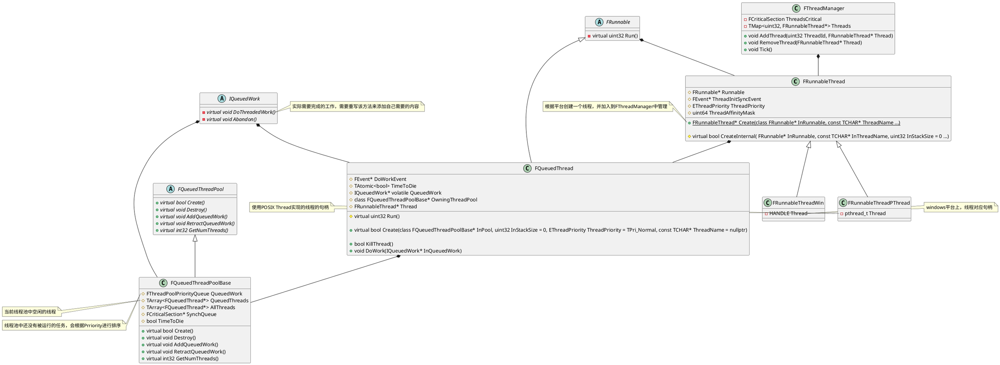
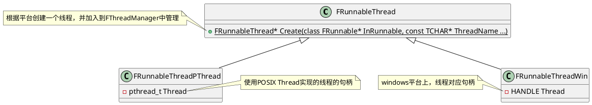
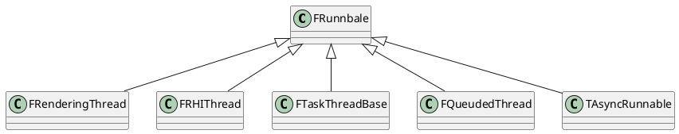
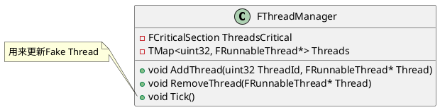
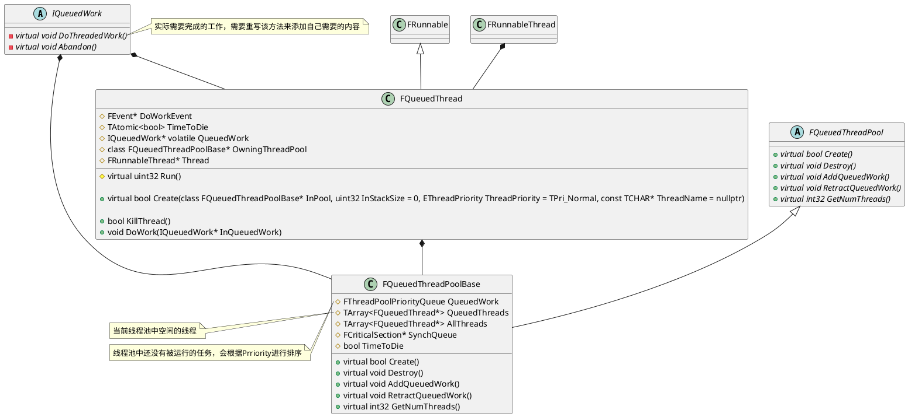

## Unreal Engine中的异步系统

<!-- @import "[TOC]" {cmd="toc" depthFrom=1 depthTo=6 orderedList=false} -->

<!-- code_chunk_output -->

- [Unreal Engine中的异步系统](#unreal-engine中的异步系统)
  - [类图Overall](#类图overall)
  - [FRunnableThread 和 FRunnable实现](#frunnablethread-和-frunnable实现)
    - [FRunnableThread](#frunnablethread)
    - [FRunnable相关实现](#frunnable相关实现)
    - [FThreadManager](#fthreadmanager)
  - [异步任务的实现](#异步任务的实现)
    - [队列化任务的实现](#队列化任务的实现)
      - [FQueuedThread](#fqueuedthread)
      - [FQueuedThreadPoolBase](#fqueuedthreadpoolbase)
    - [TaskGraph的实现](#taskgraph的实现)

<!-- /code_chunk_output -->


### 类图Overall


### FRunnableThread 和 FRunnable实现

#### FRunnableThread
FRunnableThread 是UE中所有线程的基类，根据不同的平台有不同的实现。例如在Windows平台的FRunnableThreadWin，以及通过pthread实现的FRunnableThreadPThread等等。
线程在创建成功之后，会先加入到FThreadManager之中，然后再调用FRunnableThread::Run函数，而后会调用FRunnable::Run
```cpp
// Windows 平台相关的实现
static ::DWORD STDCALL _ThreadProc(LPVOID pThis)
{
	check(pThis);
	auto* ThisThread = (FRunnableThreadWin*)pThis;
	FThreadManager::Get().AddThread(ThisThread->GetThreadID(), ThisThread);
	return ThisThread->GuardedRun();
}

uint32 FRunnableThreadWin::GuardedRun()
{
	uint32 ExitCode = 0;

	FPlatformProcess::SetThreadAffinityMask(ThreadAffinityMask);

	FPlatformProcess::SetThreadName(*ThreadName);
	const TCHAR* CmdLine = ::GetCommandLineW();
	bool bNoExceptionHandler = FParse::Param(::GetCommandLineW(), TEXT("noexceptionhandler"));
#if UE_BUILD_DEBUG
	if (true && !GAlwaysReportCrash)
#else
	if (bNoExceptionHandler || (FPlatformMisc::IsDebuggerPresent() && !GAlwaysReportCrash))
#endif // UE_BUILD_DEBUG
	{
		ExitCode = Run();
	}
	else
	{
#if !PLATFORM_SEH_EXCEPTIONS_DISABLED
		__try
#endif // !PLATFORM_SEH_EXCEPTIONS_DISABLED
		{
			ExitCode = Run();
		}
#if !PLATFORM_SEH_EXCEPTIONS_DISABLED
		__except (FPlatformMisc::GetCrashHandlingType() == ECrashHandlingType::Default ? ReportCrash(GetExceptionInformation()) : EXCEPTION_CONTINUE_SEARCH)
		{
			__try
			{
				// Make sure the information which thread crashed makes it into the log.
				UE_LOG( LogThreadingWindows, Error, TEXT( "Runnable thread %s crashed." ), *ThreadName );
				GWarn->Flush();

				// Append the thread name at the end of the error report.
				FCString::Strncat( GErrorHist, TEXT(LINE_TERMINATOR_ANSI "Crash in runnable thread " ), UE_ARRAY_COUNT( GErrorHist ) );
				FCString::Strncat( GErrorHist, *ThreadName, UE_ARRAY_COUNT( GErrorHist ) );

				// Crashed.
				ExitCode = 1;
				GError->HandleError();
				FPlatformMisc::RequestExit(true, TEXT("FRunnableThreadWin::GuardedRun.ExceptionHandler"));
			}
			__except(EXCEPTION_EXECUTE_HANDLER)
			{
				// The crash handler crashed itself, exit with a code which the 
				// out-of-process monitor will be able to pick up and report into 
				// analytics.

				::exit(ECrashExitCodes::CrashHandlerCrashed);
			}
		}
#endif // !PLATFORM_SEH_EXCEPTIONS_DISABLED
	}

	return ExitCode;
}

uint32 FRunnableThreadWin::Run()
{
	uint32 ExitCode = 1;
	check(Runnable);

	if (Runnable->Init() == true)
	{
		ThreadInitSyncEvent->Trigger();

		// Setup TLS for this thread, used by FTlsAutoCleanup objects.
		SetTls();

		ExitCode = Runnable->Run();

		// Allow any allocated resources to be cleaned up
		Runnable->Exit();

#if STATS
		FThreadStats::Shutdown();
#endif
		FreeTls();
	}
	else
	{
		// Initialization has failed, release the sync event
		ThreadInitSyncEvent->Trigger();
	}

	return ExitCode;
}
```

**FRunnableThread::Create**中会调用FRunnableThread::CreateInternal函数，这个函数在不同的平台有不同的实现，从而创建平台相关的HAL
```cpp
FRunnableThread* FRunnableThread::Create(
	class FRunnable* InRunnable, 
	const TCHAR* ThreadName,
	uint32 InStackSize,
	EThreadPriority InThreadPri, 
	uint64 InThreadAffinityMask,
	EThreadCreateFlags InCreateFlags)
{
	bool bCreateRealThread = FPlatformProcess::SupportsMultithreading();

	FRunnableThread* NewThread = nullptr;

	if (bCreateRealThread)
	{
		check(InRunnable);
		// Create a new thread object
		NewThread = FPlatformProcess::CreateRunnableThread();
	}
	else if (InRunnable->GetSingleThreadInterface())
	{
		// Create a fake thread when multithreading is disabled.
		NewThread = new FFakeThread();
	}

	if (NewThread)
	{
		SetupCreatedThread(NewThread, InRunnable, ThreadName, InStackSize, InThreadPri, InThreadAffinityMask, InCreateFlags);
	}

	return NewThread;
}

void FRunnableThread::SetupCreatedThread(FRunnableThread*& NewThread, class FRunnable* InRunnable,  const TCHAR* ThreadName, uint32 InStackSize, EThreadPriority InThreadPri, uint64 InThreadAffinityMask, EThreadCreateFlags InCreateFlags)
{
	// Call the thread's create method
	bool bIsValid = NewThread->CreateInternal(InRunnable, ThreadName, InStackSize, InThreadPri, InThreadAffinityMask, InCreateFlags);

	if( bIsValid )
	{
		check(NewThread->Runnable);
		NewThread->PostCreate(InThreadPri);
	}
	else
	{
		// We failed to start the thread correctly so clean up
		delete NewThread;
		NewThread = nullptr;
	}
}
```

#### FRunnable相关实现
FRunnable是一个可以运行在线程上的任务的接口，可以通过继承他来实现一个可以在线程上运行的任务，他不能独立的存在，需要依赖真正的线程来执行任务。FRunableThread在运行时，最终会调用到FRunnable::Run。FRunnable的子类有很多，下面列举了一些：


#### FThreadManager
FThreadManager是UE中用于管理线程的类，游戏中创建出来的线程都会加入该管理器中进行管理。该类的功能比较简单，使用一个TMap保存了创建出来的线程，使用ThreadID当Key。另外还会Tick线程中的FFakeThread，FFakeThread是一种假的线程，实际上还是单线程，并没有在一个独立的线程中执行。



### 异步任务的实现

#### 队列化任务的实现
UE中的队列化任务主要有以下几个接口和类来实现：
- IQueuedWork是可以被运行在队列化的线程池中的线程执行的任务的基类。和FRunnable一样，它不能独立的执行自己的任务，需要和相应的线程来配合。
- FQueuedThread，包含了需要执行的任务IQueuedWork和执行任务的线程FRunnableThread，它继承于FRunnable，是真正执行IQueuedWork任务的类。
- FQueuedThreadPool是队列化线程池的基类，定义了线程池所需要的接口。FQueuedThreadPoolBase是UE实现的默认的线程池的版本。



##### FQueuedThread
FQueuedThread继承于FRunable，同时它也包含一个FRunnableThread的引用。一方面它代表了被线程池管理的那些线程，另外一方面它也包含了执行任务的逻辑。它的任务就是在运行的时候不断的从线程池中拿出队列中还没有执行的任务，然后执行它。如果线程池中的任务已经被执行完了，它就会把自己返回到线程池的空闲队列中。主要的逻辑在FQueuedThread::Run中：
```cpp
uint32 FQueuedThread::Run()
{
	while (!TimeToDie.Load(EMemoryOrder::Relaxed))
	{
		// This will force sending the stats packet from the previous frame.
		SET_DWORD_STAT(STAT_ThreadPoolDummyCounter, 0);
		// We need to wait for shorter amount of time
		bool bContinueWaiting = true;

		// Unless we're collecting stats there doesn't appear to be any reason to wake
		// up again until there's work to do (or it's time to die)

#if STATS
		if (FThreadStats::IsCollectingData())
		{
			while (bContinueWaiting)
			{
				DECLARE_CYCLE_STAT_WITH_FLAGS(TEXT("FQueuedThread::Run.WaitForWork"),
				STAT_FQueuedThread_Run_WaitForWork, STATGROUP_ThreadPoolAsyncTasks,
					EStatFlags::Verbose);

				SCOPE_CYCLE_COUNTER(STAT_FQueuedThread_Run_WaitForWork);

				// Wait for some work to do

				bContinueWaiting = !DoWorkEvent->Wait(GDoPooledThreadWaitTimeouts ? 10 : MAX_uint32);
			}
		}
#endif

		if (bContinueWaiting)
		{
			DoWorkEvent->Wait();
		}

		IQueuedWork* LocalQueuedWork = QueuedWork;
		QueuedWork = nullptr;
		FPlatformMisc::MemoryBarrier();
		check(LocalQueuedWork || TimeToDie.Load(EMemoryOrder::Relaxed)); // well you woke me up, where is the job or termination request?
		while (LocalQueuedWork)
		{
			// Tell the object to do the work
			LocalQueuedWork->DoThreadedWork();
			// Let the object cleanup before we remove our ref to it
			LocalQueuedWork = OwningThreadPool->ReturnToPoolOrGetNextJob(this);
		}
	}
	return 0;
}
```

##### FQueuedThreadPoolBase
FQueuedThreadPoolBase是UE中线程池的实现，主要就是管理线程池中的任务，先线程池中添加新任务，撤回任务这些等等。
- QueuedThreadPoolBase::AddQueuedWork 向线程池中添加任务，如果线程池中有空闲的线程，则开始执行该任务
- QueuedThreadPoolBase::RetractQueuedWork 如果该任务还没有开始执行，则撤销该任务，之后不会执行该任务
- QueuedThreadPoolBase::ReturnToPoolOrGetNextJob 这个接口会被FQueuedThread调用，当FQueuedThread执行完一个任务后，会调用该接口。如果已经没有可执行的任务了，会将FQueuedThread归还到空闲的线程池列表中。如果还有未执行的任务，则会从未执行的任务列表拿出来，然后执行。FQueuedThreadPoolBase和FQueuedThread是一个生产者和消费着模型。
```cpp
void AddQueuedWork(IQueuedWork* InQueuedWork, EQueuedWorkPriority InQueuedWorkPriority) override
{
	check(InQueuedWork != nullptr);

	if (TimeToDie)
	{
		InQueuedWork->Abandon();
		return;
	}

	// Check to see if a thread is available. Make sure no other threads
	// can manipulate the thread pool while we do this.
	//
	// We pick a thread from the back of the array since this will be the
	// most recently used thread and therefore the most likely to have
	// a 'hot' cache for the stack etc (similar to Windows IOCP scheduling
	// strategy). Picking from the back also happens to be cheaper since
	// no memory movement is necessary.

	check(SynchQueue);

	FQueuedThread* Thread = nullptr;

	{
		FScopeLock sl(SynchQueue);
		const int32 AvailableThreadCount = QueuedThreads.Num();
		if (AvailableThreadCount == 0)
		{
			// No thread available, queue the work to be done
			// as soon as one does become available
			QueuedWork.Enqueue(InQueuedWork, InQueuedWorkPriority);
			return;
		}

		const int32 ThreadIndex = AvailableThreadCount - 1;

		Thread = QueuedThreads[ThreadIndex];
		// Remove it from the list so no one else grabs it
		QueuedThreads.RemoveAt(ThreadIndex, 1, /* do not allow shrinking */ false);
	}

	// Tell our chosen thread to do the work
	Thread->DoWork(InQueuedWork);
}

virtual bool RetractQueuedWork(IQueuedWork* InQueuedWork) override
{
	if (TimeToDie)
	{
		return false; // no special consideration for this, refuse the retraction and let shutdown proceed
	}
	check(InQueuedWork != nullptr);
	check(SynchQueue);
	FScopeLock sl(SynchQueue);
	return QueuedWork.Retract(InQueuedWork);
}

IQueuedWork* ReturnToPoolOrGetNextJob(FQueuedThread* InQueuedThread)
{
	check(InQueuedThread != nullptr);
	IQueuedWork* Work = nullptr;
	// Check to see if there is any work to be done
	FScopeLock sl(SynchQueue);
	if (TimeToDie)
	{
		check(!QueuedWork.Num());  // we better not have anything if we are dying
	}
	
	Work = QueuedWork.Dequeue();

	if (!Work)
	{
		// There was no work to be done, so add the thread to the pool
		QueuedThreads.Add(InQueuedThread);
	}
	return Work;
}
```

#### TaskGraph的实现