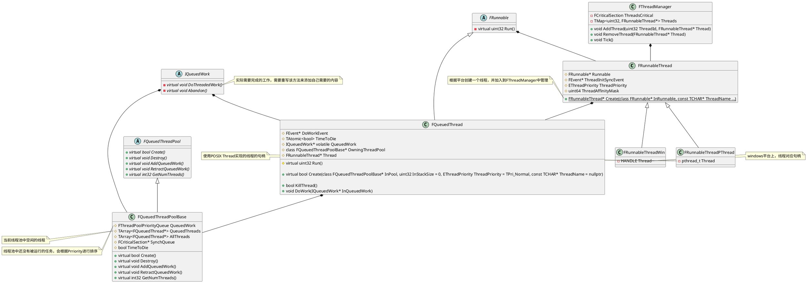
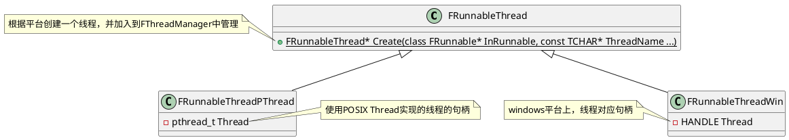
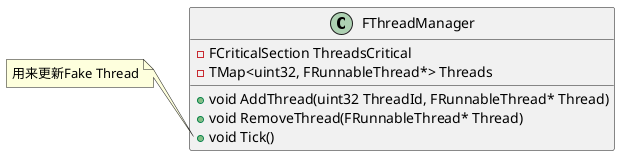
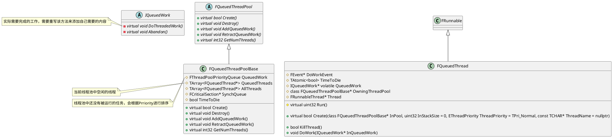
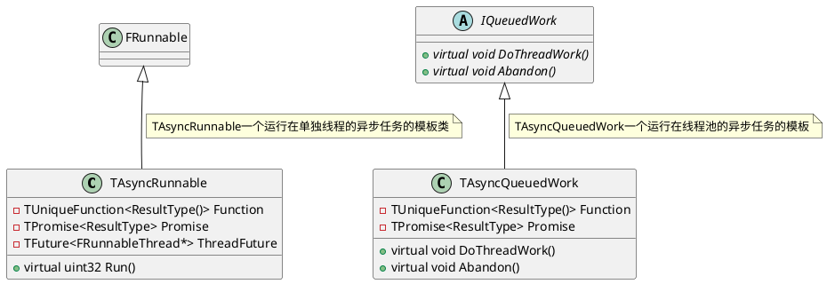

## Unreal Engine中的异步系统

<!-- @import "[TOC]" {cmd="toc" depthFrom=1 depthTo=6 orderedList=false} -->

<!-- code_chunk_output -->

- [Unreal Engine中的异步系统](#unreal-engine中的异步系统)
  - [类图Overall](#类图overall)
  - [FRunnableThread 和 FRunnable实现](#frunnablethread-和-frunnable实现)
    - [FThreadManager](#fthreadmanager)
    - [FRunnable相关实现](#frunnable相关实现)
  - [异步任务的实现](#异步任务的实现)
    - [线程池的实现](#线程池的实现)
    - [TaskGraph的实现](#taskgraph的实现)

<!-- /code_chunk_output -->


### 类图Overall


### FRunnableThread 和 FRunnable实现

FRunnableThread 是UE中所有线程的基类，根据不同的平台有不同的实现。例如在Windows平台的FRunnableThreadWin，以及通过pthread实现的FRunnableThreadPThread等等


**FRunnableThread::Create**会根据传入的参数返回创建好的线程，并把创建好的线程添加到线程池中
```

```

#### FThreadManager
FThreadManager是UE中用于管理线程的类，游戏中创建出来的线程都会加入该管理器中进行管理



#### FRunnable相关实现
FRunnable是一个可以运行在线程上的任务的基类，可以通过继承他来实现一个可以在线程上运行的任务,UE中的一些异步任务也是继承于它
   

FQueuedThreadPool为线程池的一个抽象类，定义了线程池需要使用到的一些函数。FQueuedThreadPoolBase则是对线程池的一个具体实现，包括：
- 创建和销毁一个线程池
- 向线程池中添加，撤回任务
- 获取线程池中线程数量等等

### 异步任务的实现

#### 线程池的实现



#### TaskGraph的实现