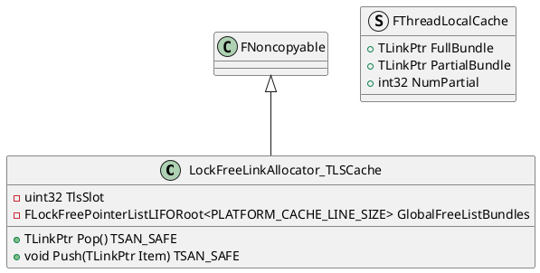
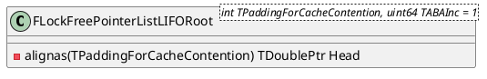

## Unreal Engine LockFreeList

### 类图

```plantuml
@startuml
class TLockFreeAllocOnceIndexedAllocator<class T, unsigned int MaxTotalItems, unsigned int ItemsPerPage>
{
    + FORCEINLINE uint32 Alloc(uint32 Count = 1)
    + FORCEINLINE T* GetItem(uint32 Index)

    - void* GetRawItem(uint32 Index)
    - alignas(PLATFORM_CACHE_LINE_SIZE) FThreadSafeCounter NextIndex
    - alignas(PLATFORM_CACHE_LINE_SIZE) T* Pages[MaxBlocks]
}

struct FIndexedPointer
{
    - uint64 Ptrs
}

struct FIndexedLockFreeLink
{
    + FIndexedPointer DoubleNext
	+ void *Payload
	+ uint32 SingleNext
}

FIndexedPointer <-- FIndexedLockFreeLink

struct FLockFreeLinkPolicy
{
    + typedef FIndexedPointer TDoublePtr;
    + typedef FIndexedLockFreeLink TLink;
    + typedef uint32 TLinkPtr;
    + typedef TLockFreeAllocOnceIndexedAllocator<FIndexedLockFreeLink, MAX_LOCK_FREE_LINKS, 16384> TAllocator;

    {static} + TAllocator LinkAllocator
}

TLockFreeAllocOnceIndexedAllocator <-- FLockFreeLinkPolicy

class LockFreeLinkAllocator_TLSCache
{
    + void Push(TLinkPtr Item) TSAN_SAFE
    + TLinkPtr Pop() TSAN_SAFE
    - uint32 TlsSlot
    - FLockFreePointerListLIFORoot<PLATFORM_CACHE_LINE_SIZE> GlobalFreeListBundles
}

FLockFreeLinkPolicy <.. LockFreeLinkAllocator_TLSCache
FIndexedLockFreeLink <.. LockFreeLinkAllocator_TLSCache
FIndexedPointer <.. LockFreeLinkAllocator_TLSCache
FLockFreePointerListLIFORoot <-- LockFreeLinkAllocator_TLSCache

class FLockFreePointerListLIFORoot
{

}

class FLockFreePointerListLIFOBase<class T, int TPaddingForCacheContention, uint64 TABAInc = 1>
{

}

class FLockFreePointerFIFOBase<class T, int TPaddingForCacheContention, uint64 TABAInc = 1>
{

}

class FStallingTaskQueue<class T, int TPaddingForCacheContention, int NumPriorities>
{

}

class TLockFreePointerListLIFOPad<class T, int TPaddingForCacheContention>
{

}

FLockFreePointerListLIFOBase <|-- TLockFreePointerListLIFOPad

class TLockFreePointerListLIFO<class T>
{

}

TLockFreePointerListLIFOPad <|-- TLockFreePointerListLIFO

class TLockFreePointerListUnordered<class T, int TPaddingForCacheContention>
{

}

TLockFreePointerListLIFOPad <|-- TLockFreePointerListUnordered

class TLockFreePointerListFIFO<class T, int TPaddingForCacheContention>
{
}

FLockFreePointerFIFOBase <|-- TLockFreePointerListFIFO

class TClosableLockFreePointerListUnorderedSingleConsumer<class T, int TPaddingForCacheContention>
{

}

FLockFreePointerListLIFOBase <|-- TClosableLockFreePointerListUnorderedSingleConsumer


@enduml
```


### 实现
#### TLockFreeAllocOnceIndexedAllocator
TLockFreeAllocOnceIndexedAllocator是一个内存分配器，它的内部分为很多个Block，每个一个Block内部又分为若干个Item，每一个Block内部的内存是连续的。每个Block中Item数量和最大Item数量需要在模板实例化的时候传进去，然后通过元编程在编译期计算出Block的数量。
```cpp
template<class T, unsigned int MaxTotalItems, unsigned int ItemsPerPage>
class TLockFreeAllocOnceIndexedAllocator
{
	enum
	{
		MaxBlocks = (MaxTotalItems + ItemsPerPage - 1) / ItemsPerPage
	};
public:

....

    alignas(PLATFORM_CACHE_LINE_SIZE) T* Pages[MaxBlocks];
}
```

对于TLockFreeAllocOnceIndexedAllocator，内部分为多个Block，每个Block内部的又有多个Item，而且内存是连续的。所以，我们就可以通过索引计算出所在的Block和所在Item的首地址。

**TLockFreeAllocOnceIndexedAllocator::Alloc**用于分配对应数量的Item，并且会返回第一个Item的Index，所以外部就可以通过持有这个Index来获取分配内存的实际地址。TLockFreeAllocOnceIndexedAllocator::Alloc内部会通过调用**GetRawItem**最终来分配内存。
```cpp
FORCEINLINE uint32 Alloc(uint32 Count = 1)
{
	uint32 FirstItem = NextIndex.Add(Count);
	if (FirstItem + Count > MaxTotalItems)
	{
		LockFreeLinksExhausted(MaxTotalItems);
	}
	for (uint32 CurrentItem = FirstItem; CurrentItem < FirstItem + Count; CurrentItem++)
	{
		new (GetRawItem(CurrentItem)) T();
	}
	return FirstItem;
}

void* GetRawItem(uint32 Index)
{
	uint32 BlockIndex = Index / ItemsPerPage;
	uint32 SubIndex = Index % ItemsPerPage;
	checkLockFreePointerList(Index && Index < (uint32)NextIndex.GetValue() && Index < MaxTotalItems && BlockIndex < MaxBlocks);
	if (!Pages[BlockIndex])
	{
		T* NewBlock = (T*)LockFreeAllocLinks(ItemsPerPage * sizeof(T));
		checkLockFreePointerList(IsAligned(NewBlock, alignof(T)));
		if (FPlatformAtomics::InterlockedCompareExchangePointer((void**)&Pages[BlockIndex], NewBlock, nullptr) != nullptr)
		{
			// we lost discard block
			checkLockFreePointerList(Pages[BlockIndex] && Pages[BlockIndex] != NewBlock);
			LockFreeFreeLinks(ItemsPerPage * sizeof(T), NewBlock);
		}
		else
		{
			checkLockFreePointerList(Pages[BlockIndex]);
		}
	}
	return (void*)(Pages[BlockIndex] + SubIndex);
}
```

**GetItem**则只是简单的通过外部传入的Index，计算所在的BlockIndex，和在Block内部的Index，然后返回正确的内存地址。


#### FIndexedPointer
FIndexedPointer虽然名字上说是指针，但是其实他本身保存的是从TLockFreeAllocOnceIndexedAllocator中分配内存的索引。而且本身只使用其中的26位来保存索引，另外的一些位用来存放计数和状态。这个可以用来处理ABA的问题。因为这个索引是来自于TLockFreeAllocOnceIndexedAllocator，最终是用于链表的实现，而不是真正用于表示64位程序的地址。所以对于链表，2的26次方的数量的节点，已经足够了。从代码中可以看出来，其中低26位存放的是索引，其他的位是存放的计数和状态。
```cpp
FORCEINLINE uint32 GetPtr() const
{
	return uint32(Ptrs & (MAX_LOCK_FREE_LINKS - 1));
}

FORCEINLINE void SetPtr(uint32 To)
{
	SetAll(To, GetCounterAndState());
}

FORCEINLINE uint64 GetCounterAndState() const
{
	return (Ptrs >> MAX_LOCK_FREE_LINKS_AS_BITS);
}

FORCEINLINE void SetCounterAndState(uint64 To)
{
	SetAll(GetPtr(), To);
}
```

#### FLockFreeLinkPolicy和LockFreeLinkAllocator_LSCache
FLockFreeLinkPolicy包装了TLockFreeAllocOnceIndexedAllocator，然后在内部和LockFreeLinkAllocator_LSCache一起作为了整个LockFree容器的内存分配器。

##### LockFreeLinkAllocator_TLSCache


LockFreeLinkAllocator_TLSCache为每一个线程，在其线程内部的存储中（TLS）中保存了当前线程分配的节点，这样可以提高效率，而且每个线程之前也不会互相干扰，不需要加锁等同步操作。
FThreadLocalCache为保存在TLS中的一个链表，保存了当前线程分配的节点。FThreadLocalCache::PartialBundle保存了当前可用节点的头节点，其中TLink::Payload用来保存了下一个节点的索引。
- Pop 如果没有分配好节点，则会从GlobalFreeListBundles从分配好对应的节点，然后返回节点。如果已经分配好，则会直接返回节点。
- Push 将节点返回池中，这里是通过设置节点的TLink::Payload属性来完成的，设置为指向下一个空闲节点的索引。

###### LockFreeLinkAllocator_TLSCache::Pop
```cpp
TLinkPtr Pop() TSAN_SAFE
{
	FThreadLocalCache& TLS = GetTLS();

	if (!TLS.PartialBundle)
	{
		if (TLS.FullBundle)
		{
			TLS.PartialBundle = TLS.FullBundle;
			TLS.FullBundle = 0;
		}
		else
		{
			TLS.PartialBundle = GlobalFreeListBundles.Pop();
			if (!TLS.PartialBundle)
			{
				int32 FirstIndex = FLockFreeLinkPolicy::LinkAllocator.Alloc(NUM_PER_BUNDLE);
				for (int32 Index = 0; Index < NUM_PER_BUNDLE; Index++)
				{
					TLink* Event = FLockFreeLinkPolicy::IndexToLink(FirstIndex + Index);
					Event->DoubleNext.Init();
					Event->SingleNext = 0;
					Event->Payload = (void*)UPTRINT(TLS.PartialBundle);
					TLS.PartialBundle = FLockFreeLinkPolicy::IndexToPtr(FirstIndex + Index);
				}
			}
		}
		TLS.NumPartial = NUM_PER_BUNDLE;
	}
	TLinkPtr Result = TLS.PartialBundle;
	TLink* ResultP = FLockFreeLinkPolicy::DerefLink(TLS.PartialBundle);
	TLS.PartialBundle = TLinkPtr(UPTRINT(ResultP->Payload));
	TLS.NumPartial--;
	//checkLockFreePointerList(TLS.NumPartial >= 0 && ((!!TLS.NumPartial) == (!!TLS.PartialBundle)));
	ResultP->Payload = nullptr;
	checkLockFreePointerList(!ResultP->DoubleNext.GetPtr() && !ResultP->SingleNext);
	return Result;
}
```

###### LockFreeLinkAllocator_TLSCache::Push
```cpp
void Push(TLinkPtr Item) TSAN_SAFE
{
	FThreadLocalCache& TLS = GetTLS();
	if (TLS.NumPartial >= NUM_PER_BUNDLE)
	{
		if (TLS.FullBundle)
		{
			GlobalFreeListBundles.Push(TLS.FullBundle);
			//TLS.FullBundle = nullptr;
		}
		TLS.FullBundle = TLS.PartialBundle;
		TLS.PartialBundle = 0;
		TLS.NumPartial = 0;
	}
	TLink* ItemP = FLockFreeLinkPolicy::DerefLink(Item);
	ItemP->DoubleNext.SetPtr(0);
	ItemP->SingleNext = 0;
	ItemP->Payload = (void*)UPTRINT(TLS.PartialBundle);
	TLS.PartialBundle = Item;
	TLS.NumPartial++;
}
```


#### FLockFreePointerListLIFORoot

