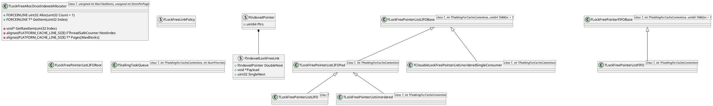

## Unreal Engine LockFreeList

### 类图

```plantuml
@startuml
class TLockFreeAllocOnceIndexedAllocator<class T, unsigned int MaxTotalItems, unsigned int ItemsPerPage>
{
    + FORCEINLINE uint32 Alloc(uint32 Count = 1)
    + FORCEINLINE T* GetItem(uint32 Index)

    - void* GetRawItem(uint32 Index)
    - alignas(PLATFORM_CACHE_LINE_SIZE) FThreadSafeCounter NextIndex
    - alignas(PLATFORM_CACHE_LINE_SIZE) T* Pages[MaxBlocks]
}

struct FIndexedPointer
{
    - uint64 Ptrs
}

struct FIndexedLockFreeLink
{
    + FIndexedPointer DoubleNext
	+ void *Payload
	+ uint32 SingleNext
}

FIndexedPointer *-- FIndexedLockFreeLink

struct FLockFreeLinkPolicy
{

}

class FLockFreePointerListLIFORoot
{

}

class FLockFreePointerListLIFOBase<class T, int TPaddingForCacheContention, uint64 TABAInc = 1>
{

}

class FLockFreePointerFIFOBase<class T, int TPaddingForCacheContention, uint64 TABAInc = 1>
{

}

class FStallingTaskQueue<class T, int TPaddingForCacheContention, int NumPriorities>
{

}

class TLockFreePointerListLIFOPad<class T, int TPaddingForCacheContention>
{

}

FLockFreePointerListLIFOBase <|-- TLockFreePointerListLIFOPad

class TLockFreePointerListLIFO<class T>
{

}

TLockFreePointerListLIFOPad <|-- TLockFreePointerListLIFO

class TLockFreePointerListUnordered<class T, int TPaddingForCacheContention>
{

}

TLockFreePointerListLIFOPad <|-- TLockFreePointerListUnordered

class TLockFreePointerListFIFO<class T, int TPaddingForCacheContention>
{
}

FLockFreePointerFIFOBase <|-- TLockFreePointerListFIFO

class TClosableLockFreePointerListUnorderedSingleConsumer<class T, int TPaddingForCacheContention>
{

}

FLockFreePointerListLIFOBase <|-- TClosableLockFreePointerListUnorderedSingleConsumer


@enduml
```

### 