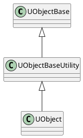

## UObject 学习笔记

UObject是UE中对象的基类，为UE4中提供大量的基础支持，包括：
- GC 垃圾回收
- 反射
- 序列化
- 编辑器支持
- 等等

### 类图

```plantuml
@startuml

UObjectBase <|-- UObjectBaseUtility

UObjectBaseUtility <|-- UObject

@enduml
```

